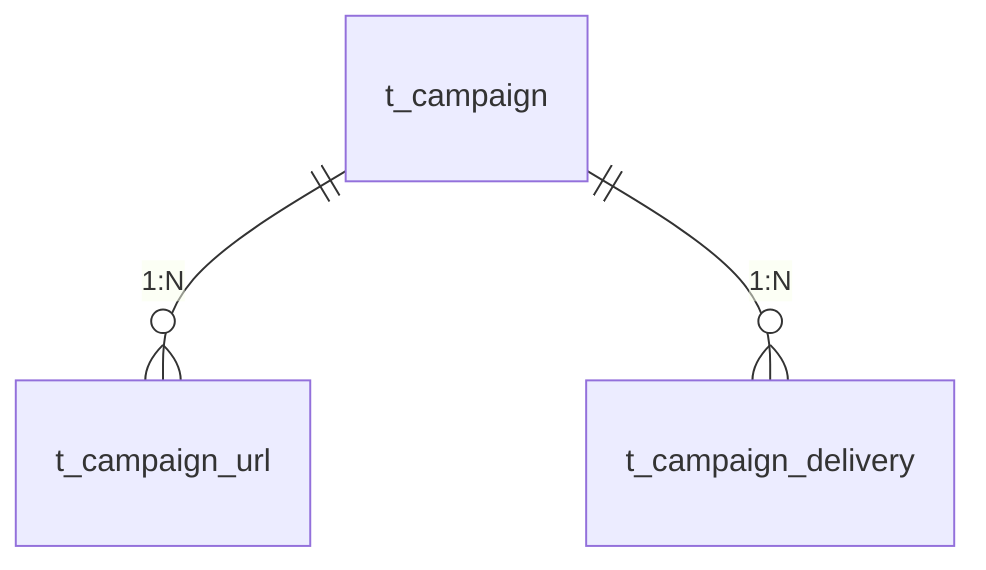
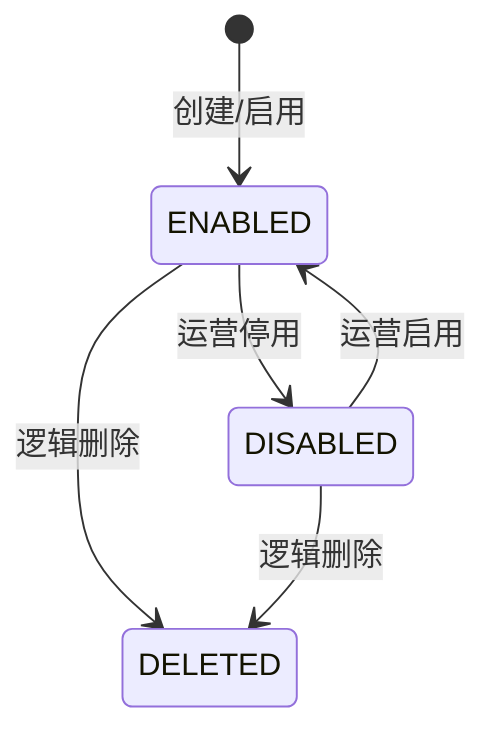
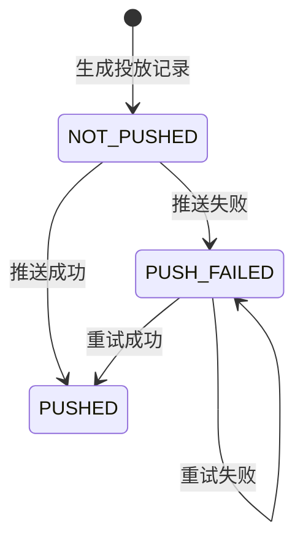

# 数据模型设计

> **文档版本**: 1.0.0  
> **更新日期**: 2026-07-09  
> **适用范围**: NPS 问卷投放模块  
> **关联文档**: `requirement/modules/05.01~05.05`

---

## 1. 实体总览

| 实体 | 表名 | 说明 | 所属模块 |
|------|------|------|----------|
| Campaign | t_campaign | 投放计划主表 | 05.01 |
| CampaignUrl | t_campaign_url | 计划问卷链接分配表 | 05.01 |
| CampaignDelivery | t_campaign_delivery | 用户投放数据表 | 05.02 / 05.03 / 05.04 / 05.05 |

---

## 2. 实体详表

### 2.1 t_campaign（投放计划主表）

| 字段 | 英文名 | 类型 | 必填 | 默认值 | 索引 | 说明 |
|------|--------|------|------|--------|------|------|
| id | id | BIGINT | 是 | AUTO_INCREMENT | PK | 主键 |
| campaign_code | campaign_code | VARCHAR(64) | 是 | - | UK | 计划编码，全局唯一 |
| campaign_name | campaign_name | VARCHAR(200) | 是 | - | - | 计划名称 |
| country | country | VARCHAR(10) | 是 | - | IDX | 国家代码，如 THA（3 位 ISO 3166-1 alpha-3 码） |
| model | model | VARCHAR(64) | 否 | - | IDX | 车型代码，如 AY5-G |
| position | position | VARCHAR(64) | 是 | - | IDX | 投放位置标识 |
| pic | pic | VARCHAR(500) | 否 | - | - | 入口图标图片 URL |
| dispatch_condition | dispatch_condition | VARCHAR(32) | 是 | - | - | 下发条件：BIND_3_MONTHS / BIND_6_MONTHS |
| start_time | start_time | TIMESTAMPTZ | 是 | - | IDX | 投放开始时间 |
| end_time | end_time | TIMESTAMPTZ | 是 | - | IDX | 投放结束时间 |
| cool_off_hours | cool_off_hours | INT | 是 | - | - | 关闭后隐藏时长（小时），0 表示永久不显示 |
| daily_dispatch_limit | daily_dispatch_limit | INT | 是 | - | - | 每日下发数量 |
| display_duration_days | display_duration_days | INT | 是 | - | - | 显示时长（天） |
| enabled | enabled | TINYINT | 是 | 1 | IDX | 启用状态：1=启用，0=停用 |
| deleted | deleted | TINYINT | 是 | 0 | IDX | 逻辑删除标记 |
| created_at | created_at | TIMESTAMPTZ | 是 | now() | - | 创建时间 |
| updated_at | updated_at | TIMESTAMPTZ | 是 | now() | - | 更新时间 |

**索引清单**：

```sql
PRIMARY KEY (`id`),
UNIQUE KEY `uk_campaign_code` (`campaign_code`),
KEY `idx_campaign_country` (`country`),
KEY `idx_campaign_model` (`model`),
KEY `idx_campaign_position` (`position`),
KEY `idx_campaign_time` (`start_time`, `end_time`),
KEY `idx_campaign_enabled` (`enabled`),
KEY `idx_campaign_deleted` (`deleted`)
```

---

### 2.2 t_campaign_url（计划问卷链接分配表）

| 字段 | 英文名 | 类型 | 必填 | 默认值 | 索引 | 说明 |
|------|--------|------|------|--------|------|------|
| id | id | BIGINT | 是 | AUTO_INCREMENT | PK | 主键 |
| campaign_id | campaign_id | BIGINT | 是 | - | FK + IDX | 投放计划 ID |
| url_code | url_code | VARCHAR(64) | 是 | - | - | 问卷 URL ID，如 NPS-1001 |
| url | url | VARCHAR(500) | 是 | - | - | 问卷 H5 地址 |
| percentage | percentage | INT | 是 | - | - | 分配比例（%） |
| deleted | deleted | TINYINT | 是 | 0 | - | 逻辑删除标记 |
| created_at | created_at | TIMESTAMPTZ | 是 | now() | - | 创建时间 |
| updated_at | updated_at | TIMESTAMPTZ | 是 | now() | - | 更新时间 |

**索引清单**：

```sql
PRIMARY KEY (`id`),
KEY `idx_campaign_url_campaign_id` (`campaign_id`)
```

---

### 2.3 t_campaign_delivery（用户投放数据表）

| 字段 | 英文名 | 类型 | 必填 | 默认值 | 索引 | 说明 |
|------|--------|------|------|--------|------|------|
| id | id | BIGINT | 是 | AUTO_INCREMENT | PK | 主键 |
| campaign_id | campaign_id | BIGINT | 是 | - | FK + IDX | 投放计划 ID |
| campaign_code | campaign_code | VARCHAR(64) | 是 | - | IDX | 计划编码 |
| one_id | one_id | VARCHAR(64) | 是 | - | IDX | 用户唯一标识 |
| user_nickname | user_nickname | VARCHAR(100) | 否 | - | - | 用户昵称（展示用） |
| phone | phone | VARCHAR(20) | 否 | - | - | 手机号（脱敏存储） |
| email | email | VARCHAR(100) | 否 | - | - | 邮箱（脱敏存储） |
| model | model | VARCHAR(64) | 否 | - | IDX | 下发时用户车型 |
| url_code | url_code | VARCHAR(64) | 是 | - | - | 实际分配的问卷 ID |
| url | url | VARCHAR(500) | 是 | - | - | 实际分配的问卷地址 |
| send_time | send_time | TIMESTAMPTZ | 是 | - | IDX | 下发时间 |
| start_time | start_time | TIMESTAMPTZ | 是 | - | IDX | 投放开始时间 |
| end_time | end_time | TIMESTAMPTZ | 是 | - | IDX | 投放结束时间 |
| completed | completed | TINYINT | 是 | 0 | IDX | 是否完成：1=是，0=否 |
| push_status | push_status | VARCHAR(32) | 是 | NOT_PUSHED | IDX | 推送状态：NOT_PUSHED / PUSHED / PUSH_FAILED |
| deleted | deleted | TINYINT | 是 | 0 | IDX | 逻辑删除标记 |
| created_at | created_at | TIMESTAMPTZ | 是 | now() | - | 创建时间 |
| updated_at | updated_at | TIMESTAMPTZ | 是 | now() | - | 更新时间 |

**索引清单**：

```sql
PRIMARY KEY (`id`),
UNIQUE KEY `uk_campaign_delivery_campaign_id_one_id` (`campaign_id`, `one_id`),
KEY `idx_campaign_delivery_campaign_code` (`campaign_code`),
KEY `idx_campaign_delivery_one_id` (`one_id`),
KEY `idx_campaign_delivery_model` (`model`),
KEY `idx_campaign_delivery_send_time` (`send_time`),
KEY `idx_campaign_delivery_start_time` (`start_time`),
KEY `idx_campaign_delivery_end_time` (`end_time`),
KEY `idx_campaign_delivery_completed` (`completed`),
KEY `idx_campaign_delivery_push_status` (`push_status`),
KEY `idx_campaign_delivery_deleted` (`deleted`)
```

---

## 3. 实体关系



---

## 4. 状态机

### 4.1 投放计划启用状态



**状态字段**：`enabled` + `deleted`

| enabled | deleted | 展示状态 |
|---------|---------|----------|
| 1 | 0 | 启用 |
| 0 | 0 | 停用 |
| 0/1 | 1 | 已删除 |

### 4.2 投放数据推送状态



**状态字段**：`push_status`

| 状态 | 说明 |
|------|------|
| NOT_PUSHED | 未推送 |
| PUSHED | 已推送 |
| PUSH_FAILED | 推送失败 |

---

## 5. 枚举定义

### 5.1 投放位置（position）

| 枚举值 | 说明 |
|--------|------|
| REMOTE_CONTROL_RIGHT_BOTTOM | 车控页右下角浮标 |
| SHOWROOM_POPUP | 展厅弹窗 |

### 5.2 下发条件（dispatch_condition）

| 枚举值 | 说明 |
|--------|------|
| BIND_3_MONTHS | 绑车满 3 个月 |
| BIND_6_MONTHS | 绑车满 6 个月 |

### 5.3 推送状态（push_status）

| 枚举值 | 说明 |
|--------|------|
| NOT_PUSHED | 未推送 |
| PUSHED | 已推送 |
| PUSH_FAILED | 推送失败 |

---

## 6. 建表语句

### 6.1 t_campaign

```sql
CREATE TABLE `t_campaign` (
  `id` BIGINT NOT NULL AUTO_INCREMENT COMMENT '主键',
  `campaign_code` VARCHAR(64) NOT NULL COMMENT '计划编码',
  `campaign_name` VARCHAR(200) NOT NULL COMMENT '计划名称',
  `country` VARCHAR(10) NOT NULL COMMENT '国家',
  `model` VARCHAR(64) DEFAULT NULL COMMENT '车型',
  `position` VARCHAR(64) NOT NULL COMMENT '投放位置',
  `pic` VARCHAR(500) DEFAULT NULL COMMENT '入口图片 URL',
  `dispatch_condition` VARCHAR(32) NOT NULL COMMENT '下发条件',
  `start_time` TIMESTAMP NOT NULL COMMENT '投放开始时间',
  `end_time` TIMESTAMP NOT NULL COMMENT '投放结束时间',
  `cool_off_hours` INT NOT NULL COMMENT '关闭后隐藏时长（小时）',
  `daily_dispatch_limit` INT NOT NULL COMMENT '每日下发数量',
  `display_duration_days` INT NOT NULL COMMENT '显示时长（天）',
  `enabled` TINYINT NOT NULL DEFAULT 1 COMMENT '启用状态：1启用 0停用',
  `deleted` TINYINT NOT NULL DEFAULT 0 COMMENT '逻辑删除标记',
  `created_at` TIMESTAMP NOT NULL DEFAULT CURRENT_TIMESTAMP COMMENT '创建时间',
  `updated_at` TIMESTAMP NOT NULL DEFAULT CURRENT_TIMESTAMP ON UPDATE CURRENT_TIMESTAMP COMMENT '更新时间',
  PRIMARY KEY (`id`),
  UNIQUE KEY `uk_campaign_code` (`campaign_code`),
  KEY `idx_campaign_country` (`country`),
  KEY `idx_campaign_model` (`model`),
  KEY `idx_campaign_position` (`position`),
  KEY `idx_campaign_time` (`start_time`, `end_time`),
  KEY `idx_campaign_enabled` (`enabled`),
  KEY `idx_campaign_deleted` (`deleted`)
) ENGINE=InnoDB DEFAULT CHARSET=utf8mb4 COMMENT='投放计划主表';
```

### 6.2 t_campaign_url

```sql
CREATE TABLE `t_campaign_url` (
  `id` BIGINT NOT NULL AUTO_INCREMENT COMMENT '主键',
  `campaign_id` BIGINT NOT NULL COMMENT '投放计划 ID',
  `url_code` VARCHAR(64) NOT NULL COMMENT '问卷 URL ID',
  `url` VARCHAR(500) NOT NULL COMMENT '问卷 H5 地址',
  `percentage` INT NOT NULL COMMENT '分配比例（%）',
  `deleted` TINYINT NOT NULL DEFAULT 0 COMMENT '逻辑删除标记',
  `created_at` TIMESTAMP NOT NULL DEFAULT CURRENT_TIMESTAMP COMMENT '创建时间',
  `updated_at` TIMESTAMP NOT NULL DEFAULT CURRENT_TIMESTAMP ON UPDATE CURRENT_TIMESTAMP COMMENT '更新时间',
  PRIMARY KEY (`id`),
  KEY `idx_campaign_url_campaign_id` (`campaign_id`)
) ENGINE=InnoDB DEFAULT CHARSET=utf8mb4 COMMENT='NPS 计划问卷链接分配表';
```

### 6.3 t_campaign_delivery

```sql
CREATE TABLE `t_campaign_delivery` (
  `id` BIGINT NOT NULL AUTO_INCREMENT COMMENT '主键',
  `campaign_id` BIGINT NOT NULL COMMENT '投放计划 ID',
  `campaign_code` VARCHAR(64) NOT NULL COMMENT '计划编码',
  `one_id` VARCHAR(64) NOT NULL COMMENT '用户 OneID',
  `user_nickname` VARCHAR(100) DEFAULT NULL COMMENT '用户昵称',
  `phone` VARCHAR(20) DEFAULT NULL COMMENT '手机号',
  `email` VARCHAR(100) DEFAULT NULL COMMENT '邮箱',
  `model` VARCHAR(64) DEFAULT NULL COMMENT '车型',
  `url_code` VARCHAR(64) NOT NULL COMMENT '问卷 URL ID',
  `url` VARCHAR(500) NOT NULL COMMENT '问卷 URL',
  `send_time` TIMESTAMP NOT NULL COMMENT '下发时间',
  `start_time` TIMESTAMP NOT NULL COMMENT '投放开始时间',
  `end_time` TIMESTAMP NOT NULL COMMENT '投放结束时间',
  `completed` TINYINT NOT NULL DEFAULT 0 COMMENT '是否完成：1是 0否',
  `push_status` VARCHAR(32) NOT NULL DEFAULT 'NOT_PUSHED' COMMENT '推送状态',
  `deleted` TINYINT NOT NULL DEFAULT 0 COMMENT '逻辑删除标记',
  `created_at` TIMESTAMP NOT NULL DEFAULT CURRENT_TIMESTAMP COMMENT '创建时间',
  `updated_at` TIMESTAMP NOT NULL DEFAULT CURRENT_TIMESTAMP ON UPDATE CURRENT_TIMESTAMP COMMENT '更新时间',
  PRIMARY KEY (`id`),
  UNIQUE KEY `uk_campaign_delivery_campaign_id_one_id` (`campaign_id`, `one_id`),
  KEY `idx_campaign_delivery_campaign_code` (`campaign_code`),
  KEY `idx_campaign_delivery_one_id` (`one_id`),
  KEY `idx_campaign_delivery_model` (`model`),
  KEY `idx_campaign_delivery_send_time` (`send_time`),
  KEY `idx_campaign_delivery_start_time` (`start_time`),
  KEY `idx_campaign_delivery_end_time` (`end_time`),
  KEY `idx_campaign_delivery_completed` (`completed`),
  KEY `idx_campaign_delivery_push_status` (`push_status`),
  KEY `idx_campaign_delivery_deleted` (`deleted`)
) ENGINE=InnoDB DEFAULT CHARSET=utf8mb4 COMMENT='用户投放数据表';
```

---

## 7. 缓存设计

| Key 模式 | 类型 | TTL | 说明 |
|----------|------|-----|------|
| `nps:plan:{campaign_code}` | String | 1h | 投放计划详情缓存 |
| `nps:user:surveys:{one_id}` | String | 10m | 用户当前有效问卷缓存 |
| `nps:dispatch:lock:{campaign_id}` | String | 5m | 定时任务分布式锁 |

**缓存失效触发**：

| 缓存 Key | 失效触发操作 |
|----------|-------------|
| `nps:plan:{campaign_code}` | 计划编辑、启用/停用、删除 |
| `nps:user:surveys:{one_id}` | 用户完成问卷、投放记录更新、计划变更 |

---

## 8. 数据量预估

| 表名 | 数据量预估 | 备注 |
|------|-----------|------|
| t_campaign | < 1000 条 | 运营配置，增长较慢 |
| t_campaign_url | < 5000 条 | 每个计划 1~10 条 URL |
| t_campaign_delivery | 1000 万+ | 按用户下发，主要数据表 |

**分表策略（初期单表，预留扩展）**：
- `t_campaign_delivery`: 按 `campaign_code` 或 `one_id` 取模分表（ShardingSphere）。
