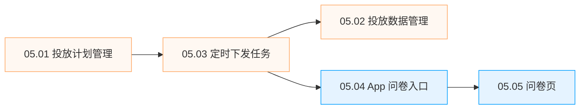
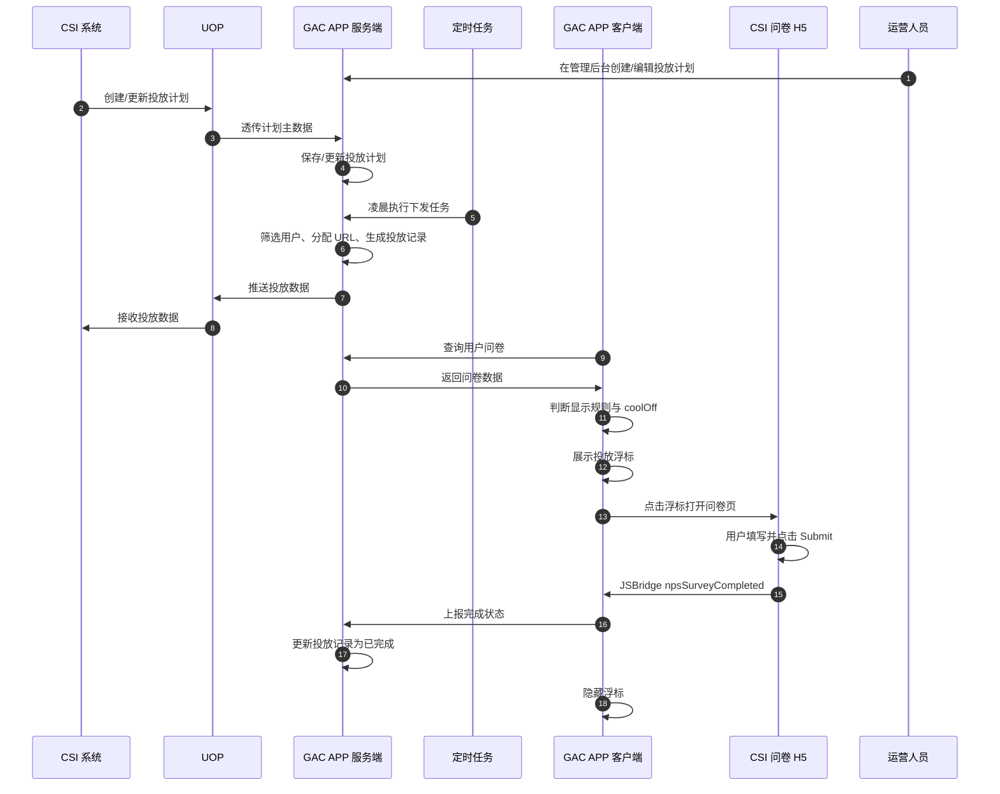
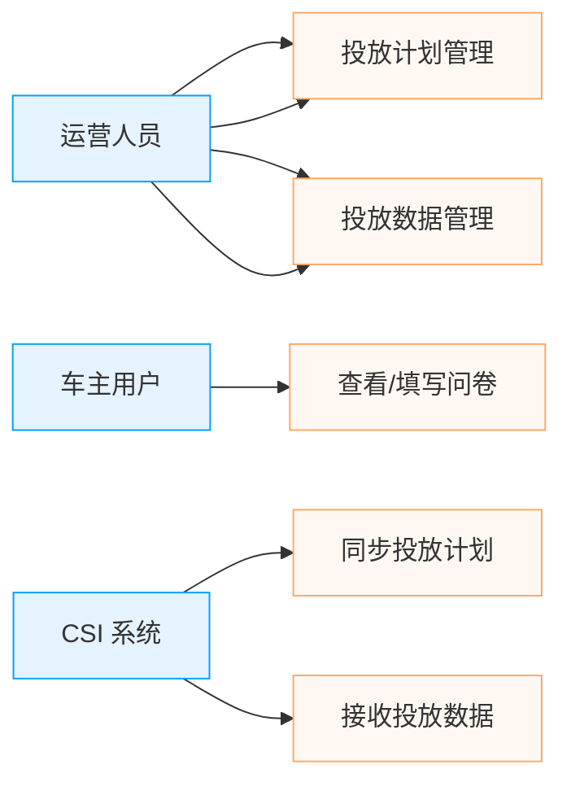

# NPS 问卷投放 — 产品需求文档（总览）

> **文档版本**: 1.0.0  
> **更新日期**: 2026-07-17  
> **适用范围**: NPS 问卷投放模块  
> **关联文档**: `requirement/功能结构.md`, `requirement/modules/05.01~05.05`, `design/数据模型.md`, `design/权限设计.md`

> **单一真相源说明**：
> - 本文负责产品边界、角色权限、业务流程、全局规则
> - `design/权限设计.md` 负责 Permission Code
> - `design/数据模型.md` 负责字段类型与 ER 关系
> - `requirement/多语言文本.md` 负责 UI 文案与 i18n key

---

## 1. 产品概述

| 字段 | 内容 |
|------|------|
| 产品名称 | NPS 问卷投放 |
| 版本号 | V1.0 |
| 文档版本 | 1.0.0 |
| 最后更新日期 | 2026-07-09 |
| 作者 | Claude |
| 审核人 | TBD |
| 文档状态 | 草稿 |

### 1.1 需求背景
NPS（Net Promoter Score，净推荐值）问卷用于收集车主对品牌与产品的满意度和推荐意愿。本需求通过 CSI 系统制定问卷投放计划，由 GAC APP 服务端按规则将问卷下发给符合条件的车主，并在 GAC APP 车控页展示问卷入口，引导用户填写问卷，最终将投放与填写数据回流至 CSI 系统，形成闭环。

### 1.2 需求目标
- 支持按国家、车型等条件精准筛选目标车主并按比例分配不同问卷链接。
- 在 App 端以低打扰的方式（车控页右下角浮标）触达用户，并支持灵活的显示频率控制。
- 打通 CSI 系统与 App 服务端的数据链路，实现投放计划下发、投放数据回流、问卷完成状态更新。
- 提供管理后台，支持运营人员配置投放计划、查看与管理投放数据。

### 1.3 相关系统与角色

| 系统 / 角色 | 说明 |
| --- | --- |
| CSI 系统 | 问卷主数据来源，创建/更新 NPS 问卷投放计划，接收投放数据与问卷完成状态 |
| UOP | 中间层，负责 CSI 与 App 服务端之间的接口透传 |
| GAC APP 服务端 | 接收投放计划、执行下发定时任务、维护投放数据、向 App 客户端提供问卷查询接口、回流数据 |
| GAC APP 客户端 | 展示问卷入口浮标、渲染问卷页、提交问卷、本地控制显示频率 |
| 运营人员 | 通过管理后台配置投放计划、管理投放数据 |
| 车主用户 | 问卷触达与填写的最终对象 |


### 1.4 范围与边界

| 类别                  | 内容                                              |
| ------------------- | ----------------------------------------------- |
| 本版本范围（In Scope）     | 投放计划管理、投放数据管理、定时下发任务、App 问卷入口、问卷 H5 容器、CSI 数据透传 |


### 1.5 外部依赖与集成

| 外部系统   | 集成方式      | 用途                 | SLA / 降级策略                   | 说明         |
| ------ | --------- | ------------------ | ---------------------------- | ---------- |
| CSI 系统 | UOP 透传    | 投放计划来源、接收投放数据与完成状态 | 5s 超时，2 次重试；失败标记 PUSH_FAILED | 计划主数据 SSOT |
| UOP    | HTTPS API | CSI 与 App 服务端中间层   | 5s 超时，2 次重试                  | 统一运营平台     |

### 1.6 版本变更记录

| 版本 | 日期 | 修改人 | 变更内容 |
|------|------|--------|----------|
| 1.0.0 | 2026-07-09 | Claude | 初始版本 |

---

## 2. 功能结构

> 📌 **权威源**：[`requirement/功能结构.md`](功能结构.md)
>
> 本节给出模块概览与核心实体总览，完整功能点清单请查阅 `requirement/功能结构.md`。

### 2.1 模块概览

| 层级 | 模块 | 说明 | 优先级 |
|------|------|------|--------|
| 平台层 | 05.01 投放计划管理 | 运营后台创建/编辑/查看/启用停用/删除投放计划 | P0 |
| 平台层 | 05.02 投放数据管理 | 运营后台查看/导入/导出/推送/删除投放数据 | P0 |
| 平台层 | 05.03 定时下发任务 | 服务端凌晨按规则执行下发并回传 CSI | P0 |
| 业务层 | 05.04 App 问卷入口 | 车控页右下角浮标展示与关闭 | P0 |
| 业务层 | 05.05 问卷页 | WebView 加载 CSI H5，提交后回调原生方法 | P0 |

### 2.2 核心实体总览

| 实体 | 英文 | 所属模块 | 关键状态 |
|------|------|----------|----------|
| 投放计划 | Campaign | 05.01 / 05.03 | `ENABLED` / `DISABLED` / `DELETED` |
| 计划问卷链接 | CampaignUrl | 05.01 | — |
| 投放数据 | CampaignDelivery | 05.02 / 05.03 / 05.04 / 05.05 | `completed` boolean；`push_status`: `NOT_PUSHED` / `PUSHED` / `PUSH_FAILED` |

> 实体详细字段定义见各子模块文档及 `design/数据模型.md`。

### 2.3 模块依赖关系



> **图例**：橙色为平台层（运营管理后台/服务端），蓝色为车主端业务层。改动上游模块时，下游模块需联动评审。

---

## 3. 信息架构

### 3.1 移动端（GAC APP）

> **承载方式**：GAC APP 是 Flutter 原生宿主。下方树状结构中，🧩 表示 Flutter 原生页面，🌐 表示 H5 WebView 容器内嵌的页面。

```
NPS 问卷投放
├── 🧩 车控页（05.04 Flutter 原生）
│   └── NPS 问卷入口浮标
└── 🌐 问卷页（05.05 H5 WebView，CSI 提供）
    └── 问卷内容 + Submit 按钮
```

### 3.2 后台管理（运营管理后台）

```
GAC 运营管理后台（已有系统）
└── Operation Management
    ├── 投放计划管理
    │   ├── 投放计划列表（筛选 / 新建 / 编辑 / 查看 / 启用停用 / 删除）
    │   └── 投放计划抽屉（新建 / 编辑 / 查看）
    └── 投放数据管理
        ├── 投放数据列表（筛选 / 导入 / 导出 / 推送 / 删除）
        └── 导入结果反馈
```

### 3.3 全局导航

| 位置 | 元素 | 说明 |
|------|------|------|
| 运营管理后台侧边栏 | Common module / Management | 入口菜单名待运营管理后台统一配置 |
| App 车控页 | 右下角浮标 | 条件满足时显示 圆形图标 |
| App 问卷页 | 顶部导航栏 + WebView | 由 CSI H5 内容填充 |

---

## 4. 核心业务流程：计划下发 → 定时投放 → 客户端触达 → 完成回流



---

## 5. 功能模块索引

| 文档 | 功能模块 | 优先级 | 层级 | 实现技术 |
|------|----------|--------|------|----------|
| [05.01-投放计划管理.md](modules/05.01-投放计划管理.md) | 投放计划管理 | P0 | 平台层 | 运营管理后台 |
| [05.02-投放数据管理.md](modules/05.02-投放数据管理.md) | 投放数据管理 | P0 | 平台层 | 运营管理后台 |
| [05.03-定时下发任务.md](modules/05.03-定时下发任务.md) | 定时下发任务 | P0 | 平台层 | 服务端（backend-only） |
| [05.04-App问卷入口.md](modules/05.04-App问卷入口.md) | App 问卷入口 | P0 | 业务层 | Flutter 原生 |
| [05.05-问卷页.md](modules/05.05-问卷页.md) | 问卷页 | P0 | 业务层 | H5 WebView（CSI 提供） |

> **注**：文件名格式为 `05.01-xxx.md`，文档内部及交叉引用均使用 `05.01`、`BR-05.01-01`、`AC-05.01-01` 形式。

---

## 6. 用户角色与权限

### 6.1 角色定义

| 角色 | 说明 | 获取方式 |
|------|------|----------|
| 运营人员 | 可创建/编辑/启用停用计划，可查看/导入/导出/推送投放数据 | 系统分配 |
| 车主用户 | 在 App 端接收问卷并填写 | GAC APP 注册用户且已绑车 |
| CSI 系统 | 外部系统，通过 UOP 透传计划与接收数据 | 服务间调用 |

### 6.2 权限矩阵

| 操作 | 运营人员 | 车主用户 | CSI 系统 |
|------|--------|----------|----------|
| 查看投放计划 | ✓ | - | - |
| 创建投放计划 | ✓ | - | - |
| 编辑投放计划 | ✓ | - | - |
| 删除投放计划 | ✓ | - | - |
| 启用/停用计划 | ✓ | - | - |
| 查看投放数据 | ✓ | - | - |
| 导入投放数据 | ✓ | - | - |
| 导出投放数据 | ✓ | - | - |
| 推送投放数据 | ✓ | - | - |
| 删除投放数据 | ✓ | - | - |
| 查询个人问卷 | - | ✓ | - |
| 上报问卷完成 | - | ✓ | - |
| 透传投放计划 | - | - | ✓ |
| 接收投放数据 | - | - | ✓ |

### 6.3 角色规则

- **RR-01** 运营人员拥有全部操作权限（含删除）；车主用户只能查询和操作自己的问卷数据。
- **RR-02** 车主用户只能查询和操作自己的问卷数据，禁止访问其他用户投放记录。
- **RR-03** CSI 系统通过服务间密钥认证，不接受外部直接调用。

### 6.4 权限场景



### 6.5 Permission Code

> 命名规则：`{资源}:{动作}:{范围}`，范围可选 `any`（任何对象）/ `own`（仅自己创建的）

| Permission Code | 含义 | 默认拥有的角色 | 备注 |
|----------------|------|--------------|------|
| `campaign:view:any` | 查看任意投放计划 | 运营人员 | |
| `campaign:create:any` | 创建投放计划 | 运营人员 | |
| `campaign:update:any` | 更新投放计划 | 运营人员 | |
| `campaign:delete:any` | 删除投放计划 | 运营人员 | 逻辑删除 |
| `campaign:enable:any` | 启用/停用投放计划 | 运营人员 | |
| `campaign_delivery:view:any` | 查看投放数据 | 运营人员 | |
| `campaign_delivery:import:any` | 导入投放数据 | 运营人员 | |
| `campaign_delivery:export:any` | 导出投放数据 | 运营人员 | |
| `campaign_delivery:push:any` | 推送投放数据至 CSI | 运营人员 | |
| `campaign_delivery:delete:any` | 删除投放数据 | 运营人员 | 逻辑删除 |

---

## 7. 全局规则

### 7.1 认证与会话
- **GR-AUTH-01** 管理后台使用 httpOnly Cookie + SameSite=Strict 认证；App 客户端使用 JWT Bearer Token。
- **GR-AUTH-02** 服务间调用须携带 `X-Internal-Key`，Gateway 拒绝外部请求携带该 Header。

### 7.2 权限控制
- **GR-PERM-01** 后端使用 `@SaCheckPermission` 注解校验 Permission Code，禁止在 Controller 硬编码角色判断。
- **GR-PERM-02** 车主端接口只能操作当前登录用户自己的投放记录。

### 7.3 分页规则
- **GR-PAGE-01** 管理后台使用传统 page/pageSize 分页，默认 20 条/页，最大 100 条/页。
- **GR-PAGE-02** App 客户端列表接口如需分页，使用 cursor 分页。

### 7.4 搜索规则
- **GR-SEARCH-01** 文本字段默认支持模糊搜索，枚举字段精确匹配，时间字段范围匹配。

### 7.5 通知规则
- **GR-NOTIFY-01** 投放数据批量推送失败时，向运营人员发送站内通知或邮件。

### 7.6 内容规范
- **GR-CONTENT-01** 计划名称、计划编码等文本字段须做 XSS 转义与长度校验。

### 7.7 错误处理
- **GR-ERROR-01** 统一返回 `{code, message, data, traceId, timestamp}` 结构；业务错误码见 `design/错误码.md`。

### 7.8 操作日志与审计
- **GR-AUDIT-01** 所有运营人员对投放计划与投放数据的写操作写入审计日志，保留 1 年。

---

## 8. 非功能性需求

### 8.1 性能

| 指标 | 目标值 | 说明 |
|------|--------|------|
| 管理后台列表加载 | ≤ 500ms | P95 |
| 用户问卷查询接口 | ≤ 200ms | P95 |
| 定时下发任务 | 1 小时内完成 | 按每日下发总量控制 |
| 投放数据导出 | ≤ 30s | 10 万条以内 |

### 8.2 安全

- **SEC-01** 用户手机号、邮箱在管理后台列表中脱敏展示。
- **SEC-02** 导入/导出文件须做格式校验与大小限制（≤10MB）。
- **SEC-03** CSI 透传接口仅允许服务间调用，须校验 `X-Internal-Key`。

### 8.3 兼容性

| 平台 | 版本 | 说明 |
|------|------|------|
| iOS | ≥ 14.0 | GAC APP 最低支持版本 |
| Android | ≥ 8.0 | GAC APP 最低支持版本 |
| 后台管理 Web | Chrome/Edge 最近 2 个大版本 | 桌面端 |

### 8.4 可用性与运维
- **OPS-01** 定时任务支持 xxl-job 分片执行，避免单点故障。
- **OPS-02** 推送 CSI 失败记录支持手动重试与定时自动重试。

### 8.5 埋点与数据分析

| 事件名称 | 触发时机 | 上报参数 | 用途 |
|----------|----------|----------|------|
| `campaign_entry_show` | 浮标展示时 | campaign_code, position | 统计曝光 |
| `campaign_entry_click` | 用户点击浮标 | campaign_code, position | 统计点击 |
| `campaign_entry_close` | 用户关闭浮标 | campaign_code, position, cool_off | 统计关闭 |
| `campaign_survey_complete` | 完成上报成功 | campaign_code, url_code | 统计完成 |

---

## 附录 A：待确认事项（Open Questions）

| 编号 | 问题 | 相关功能 | 状态 | 是否阻塞开发 | 临时默认策略 | 结论 |
|------|------|----------|------|--------------|--------------|------|
| OQ-01 | 模块编号重新从 1.1 开始 | 全局 | ✅ 已关闭 | 否 | 采用 1.1 及其子模块 05.01~05.05 | 已确认 |
| OQ-02 | 是否创建完整 SDD 目录结构 | 全局 | ✅ 已关闭 | 否 | 创建完整结构 | 已确认 |
| OQ-03 | 技术栈参考 standard 文档 | 全局 | ✅ 已关闭 | 否 | 按 standard/技术架构.md 执行 | 已确认 |
| OQ-04 | 删除采用逻辑删除 | 计划/数据 | ✅ 已关闭 | 否 | 逻辑删除 | 已确认 |
| OQ-05 | 导入/导出字段与列表一致 | 投放数据 | ✅ 已关闭 | 否 | 字段与列表一致 | 已确认 |
| OQ-06 | 问卷 H5 由 CSI 提供，只做跳转；submit 为 H5 内按钮，提交时 H5 调用原生方法，App 上报完成 | 问卷页 | ✅ 已关闭 | 否 | 按此方案设计 | 已确认 |
| OQ-07 | 多语言默认范围 | 全局 | 🟡 推迟 | 否 | 默认 zh/en/th，key 预留 | 待后续确认 |

---

## 附录 B：Traceability Matrix

| 子模块 | BR 编号 | 关联 EX | 关联 AC | 关联任务 | 关联 API | 备注 |
|--------|---------|--------|--------|----------|----------|------|
| 05.01 | BR-05.01-01 | EX-05.01-02 | AC-05.01-01, AC-05.01-07 | TASK-001 | POST /api/v1/campaigns | |
| 05.01 | BR-05.01-03 | - | AC-05.01-04 | TASK-001 | GET /api/v1/admin/campaigns | |
| 05.02 | BR-05.02-04 | EX-05.02-01 | AC-05.02-03 | TASK-005 | POST /api/v1/admin/campaigns/deliveries/import | |
| 05.03 | BR-05.03-02 | - | AC-05.03-02 | TASK-002 | 定时任务 | |
| 05.04 | BR-05.04-01 | - | AC-05.04-01, AC-05.04-04 | TASK-003 | GET /api/v1/campaigns/user/surveys | |
| 05.05 | BR-05.05-01 | EX-05.05-01, EX-05.05-02 | AC-05.05-01, AC-05.05-03 | TASK-004 | POST /api/v1/campaigns/user/surveys/complete | |

---

## 评审检查清单

- [x] 术语表的英文名与数据对象字段一致
- [x] 术语表的英文命名遵循命名规范
- [x] 权限矩阵覆盖所有角色 × 所有操作的组合
- [x] `design/权限设计.md` 中的 Permission Code 列表与本文件权限矩阵一致
- [x] 外部依赖与集成已列出所有第三方服务
- [x] 所有阻塞开发的 OQ 已关闭；未关闭但不阻塞的 OQ 已写明临时默认策略
- [x] YAML front matter 元数据与正文信息一致
- [x] 模块依赖图（2.3 节）与各子模块文件 front matter 中 depends_on 一致
- [x] 各子模块文档的 status / priority / depends_on 与总览索引表一致
- [x] 所有 `BR-xxx` / `AC-xxx` 编号全局唯一，无重复或跳号
- [x] 文档版本号已在变更记录追加新条目
