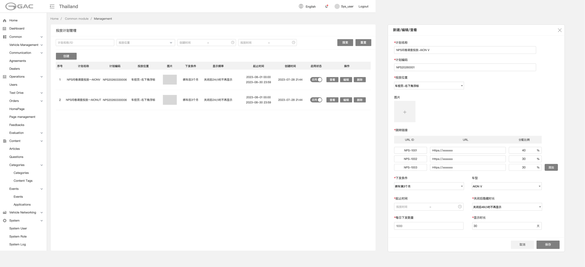
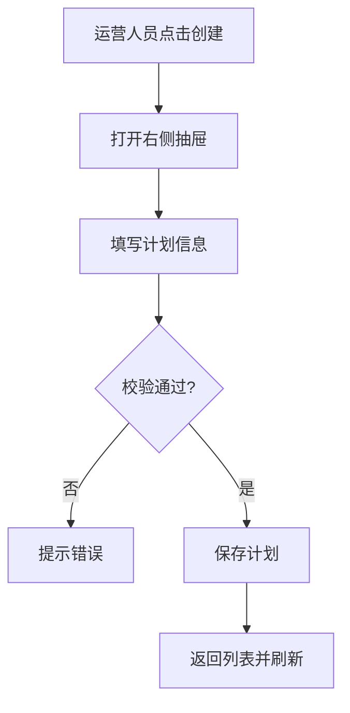
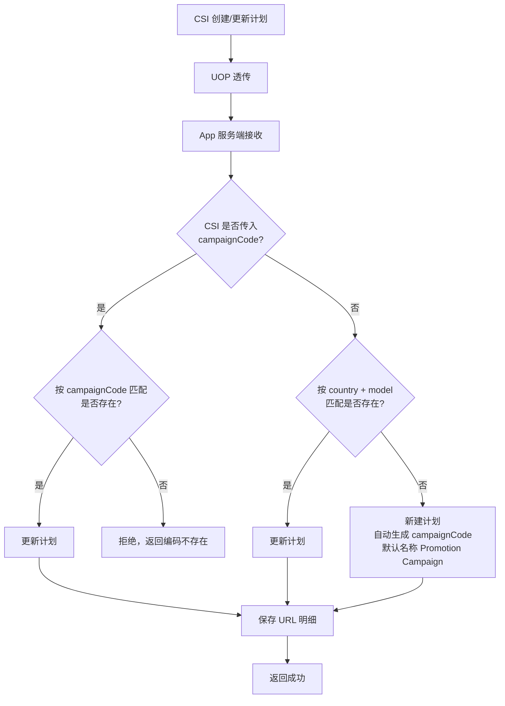
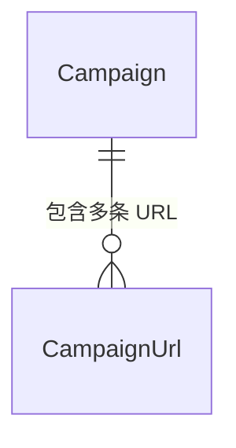
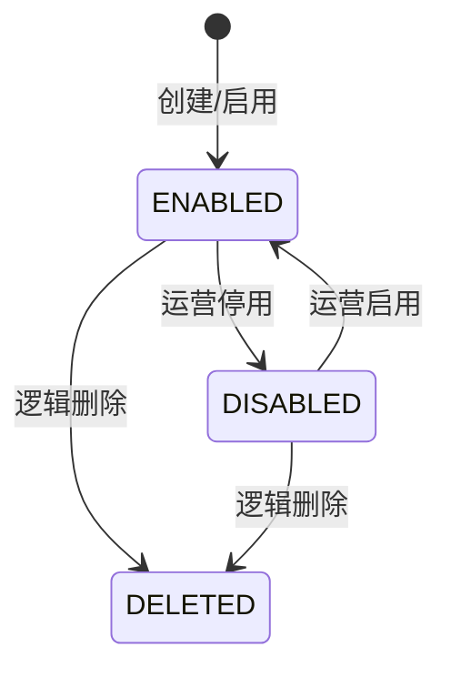

# §05.01 投放计划管理

> **层级**：平台层  
> **优先级**：P0  
> **实现技术**：运营管理后台（Vue 3 + Ant Design Vue）  
> **原型**：

---

## §05.01.1 功能概述

| 字段 | 内容 |
|------|------|
| 功能描述 | 运营管理后台对 NPS 问卷投放计划进行全生命周期管理，包括列表查询、新建、编辑、查看、启用/停用、删除；同时接收 CSI 系统通过 UOP 透传的投放计划主数据。 |
| 用户故事 | 作为运营人员，我希望在后台灵活配置投放计划（国家、车型、问卷 URL 及比例、下发条件、显示频率等），以便精准控制问卷投放策略。 |
| 涉及角色 | 运营人员、管理员、CSI 系统 |
| 前置条件 | 运营人员已登录管理后台并具备 `campaign:*` 权限；CSI 系统已对接 UOP 透传接口。 |
| 后置条件 | 投放计划保存后可供定时下发任务使用；CSI 透传的计划与后台创建的计划统一存储。 |
| 优先级 | P0 |
| 依赖功能 | 无 |

---

## §05.01.2 页面/界面描述

### 页面 A：投放计划列表

原型截图：

**页面状态**：

| 状态 | 触发条件 | 说明 |
|------|----------|------|
| 默认状态 | 首次进入 | 显示默认分页列表，每页 20 条 |
| 空状态 | 无投放计划 | 显示空状态插图与“暂无投放计划”文案 |
| 加载中 | 数据请求中 | 表格骨架屏 |
| 筛选后 | 用户点击搜索 | 按条件刷新列表 |

**页面元素清单**：

| 编号 | 元素名称 | 类型 | 默认值 | 约束/校验规则 | 交互行为 | i18n key | 说明 |
|------|----------|------|--------|---------------|----------|----------|------|
| E-A-01 | 计划名称/ID 输入框 | Input | 空 | 支持模糊搜索 | 输入后点击搜索 | `campaign.list.search_name_id` | |
| E-A-02 | 投放位置下拉 | Select | 全部 | 枚举 | 选择后筛选 | `campaign.list.filter_position` | |
| E-A-03 | 创建时间范围 | DateRange | 空 | 可选 | 选择后筛选 | `campaign.list.filter_created_time` | |
| E-A-04 | 投放时间范围 | DateRange | 空 | 可选，指计划起止时间 | 选择后筛选 | `campaign.list.filter_dispatch_time` | |
| E-A-05 | 搜索按钮 | Button | - | - | 触发列表查询 | `common.btn_search` | |
| E-A-06 | 重置按钮 | Button | - | - | 清空筛选项 | `common.btn_reset` | |
| E-A-07 | 创建按钮 | Button | - | - | 打开新建抽屉 | `campaign.list.btn_create` | |
| E-A-08 | 投放计划表格 | Table | - | - | 展示列表数据 | - | 列：序号、计划名称、计划编码、投放位置、图片、下发条件、显示时长、起止时间、创建时间、启用状态、操作 |
| E-A-09 | 启用状态开关 | Switch | 按数据 | - | 切换启用/停用 | `campaign.list.col_enabled` | |
| E-A-10 | 操作按钮组 | ButtonGroup | - | - | 查看 / 编辑 / 删除 | `common.btn_view` / `common.btn_edit` / `common.btn_delete` | |

### 页面 B：新建/编辑/查看抽屉

原型截图：（右侧抽屉）

**页面状态**：

| 状态 | 触发条件 | 说明 |
|------|----------|------|
| 新建 | 点击创建 | 所有字段可编辑，标题“新建投放计划” |
| 编辑 | 点击编辑 | 部分字段可编辑（`campaign_code` 不可改） |
| 查看 | 点击查看 | 全部字段只读，隐藏保存按钮 |

**页面元素清单**：

| 编号     | 元素名称    | 类型            | 默认值    | 约束/校验规则               | 交互行为     | i18n key                               | 说明                 |
| ------ | ------- | ------------- | ------ | --------------------- | -------- | -------------------------------------- | ------------------ |
| E-B-01 | 计划名称    | Input         | 空      | 必填，1-200 字符           | -        | `campaign.form.name`               | 例：问卷调查投放-AION V |
| E-B-02 | 计划编码    | Input         | 空      | 必填，唯一，1-64 字符         | 新建后不可编辑  | `campaign.form.code`               | 例：NPS20260001      |
| E-B-03 | 投放位置    | Select        | 空      | 必填，枚举                 | -        | `campaign.form.position`           | 车控页-右下角浮标          |
| E-B-04 | 图片上传    | ImageUploader | 空      | 非必填，≤3MB，jpg/png/webp | -        | `campaign.form.image`              | 入口图标               |
| E-B-05 | 跳转链接明细  | TableInput    | 至少 1 行 | 必填，URL ID + URL + 比例  | 支持添加/删除行 | `campaign.form.urls`               | 比例之和=100%          |
| E-B-06 | URL ID  | Input         | 空      | 必填，1-64 字符            | -        | `campaign.form.url_id`             | 例：NPS-1001         |
| E-B-07 | URL     | Input         | 空      | 必填，合法 URL             | -        | `campaign.form.url`                | 问卷 H5 地址           |
| E-B-08 | 分配比例    | NumberInput   | 0      | 必填，整数，0-100           | 实时校验总和   | `campaign.form.percentage`         | 单位 %               |
| E-B-09 | 下发条件    | Select        | 空      | 必填，枚举                 | -        | `campaign.form.dispatch_condition` | 绑车满3个月 / 绑车满6个月    |
| E-B-10 | 车型      | Select        | 空      | 非必填                   | -        | `campaign.form.model`              | 例：AION V           |
| E-B-11 | 起止时间    | DateTimeRange | 空      | 必填                    | -        | `campaign.form.time_range`         | 控制下发任务窗口           |
| E-B-12 | 关闭后隐藏时长 | Select        | 空      | 必填，枚举                 | -        | `campaign.form.cool_off`           | 24h / 48h / 永久不显示  |
| E-B-13 | 每日下发数量  | NumberInput   | 空      | 必填，正整数                | -        | `campaign.form.daily_limit`        | 例：1000             |
| E-B-14 | 显示时长    | NumberInput   | 空      | 必填，正整数，单位天            | -        | `campaign.form.display_duration`   | 例：30               |
| E-B-15 | 保存按钮    | Button        | -      | -                     | 提交表单     | `common.btn_save`                      |                    |
| E-B-16 | 取消按钮    | Button        | -      | -                     | 关闭抽屉     | `common.btn_cancel`                    |                    |

---

## §05.01.3 交互逻辑

### 主流程：创建投放计划



### CSI 透传接收流程



### 页面跳转关系

| 起始页 | 触发动作 | 目标页 | 携带参数 | 说明 |
|--------|----------|--------|----------|------|
| 投放计划列表 | 点击创建 | 新建抽屉 | - | 右侧抽屉 |
| 投放计划列表 | 点击查看 | 查看抽屉 | planId | 只读 |
| 投放计划列表 | 点击编辑 | 编辑抽屉 | planId | 可编辑 |

---

## §05.01.4 业务规则

- **BR-05.01-01** 投放计划编码 `campaign_code` 在系统内全局唯一，不可重复；新建后不可修改。CSI 透传时的匹配规则：若 CSI 传入了 `campaign_code`，以其作为唯一匹配键查找已有计划；若 CSI 未传入 `campaign_code`，则以 `country + model` 组合匹配。（→ AC-05.01-01, AC-05.01-06）
- **BR-05.01-02** 同一投放计划内所有 URL 分配比例之和必须等于 100%；保存/透传更新时须校验，否则拒绝。（→ AC-05.01-02, AC-05.01-06）
- **BR-05.01-03** 计划起止时间仅控制定时下发任务的执行窗口，不影响 App 端入口展示；App 端展示依据每个用户的独立投放时间段。（→ AC-05.01-04）
- **BR-05.01-04** 投放位置、关闭后隐藏时长、每日下发数量、下发条件、显示图标地址等字段由 App 端提供默认值且可修改；计划 ID/名称/国家/车型/问卷 ID/URL/下发比例来自 CSI 投放计划字段。（→ AC-05.01-03）
- **BR-05.01-05** 投放计划支持启用/停用；停用后不再参与新的定时下发，但已生成的投放记录仍按原规则展示。（→ AC-05.01-05）
- **BR-05.01-06** 投放计划删除采用逻辑删除（`deleted = 1`），保留审计轨迹；删除后不再参与下发与查询。（→ AC-05.01-07）
- **BR-05.01-07** 入口图标图片非必填，上传时限制格式为 jpg/png/webp，单张大小 ≤ 3MB。（→ AC-05.01-03）
- **BR-05.01-08** CSI 透传未传入 `campaignCode` 且按 `country + model` 未匹配到已有计划时，系统自动生成投放编码后新建计划；`campaignName` 若未传入则默认为 "Promotion Campaign"。投放编码生成规则由 App 服务端定义（建议格式：`CAM{AUTO_SEQ}`，如 `CAM0001`），须确保全局唯一。（→ AC-05.01-01）

---

## §05.01.5 异常处理

| 编号 | 场景 | 触发条件 | 系统行为 | 用户提示 | 恢复方式 |
|------|------|----------|----------|----------|----------|
| EX-05.01-01 | CSI 投放计划比例错误 | 透传请求中各 URL 比例之和不等于 100% | 拒绝保存，返回错误码 | CSI 侧收到 400 错误 | CSI 修正后重新透传 |
| EX-05.01-02 | 投放计划编码重复 | 新建/透传时 `campaign_code` 已存在 | 拒绝保存 | 提示“计划编码已存在” | 更换编码或更新已有计划 |
| EX-05.01-03 | 图片格式/大小不合规 | 上传非 jpg/png/webp 或超过 3MB | 拒绝上传 | 提示”图片格式或大小不符合要求” | 重新上传合规图片 |
| EX-05.01-04 | 编辑时修改只读字段 | 前端篡改 `campaign_code` | 后端忽略或返回错误 | 提示“计划编码不可修改” | 刷新页面后重试 |
| EX-05.01-05 | 删除已被使用的计划 | 计划已生成投放记录 | 逻辑删除，保留历史数据 | 二次确认后删除 | 无 |

---

## §05.01.6 数据对象

### Campaign（投放计划）

| 字段      | 英文名                   | 类型          | 必填  | 约束                                                 | 说明                 |
| ------- | --------------------- | ----------- | --- | -------------------------------------------------- | ------------------ |
| 计划 ID   | id                    | long        | 是   | 主键自增                                               |                    |
| 计划编码    | campaign_code         | string(64)  | 是   | 唯一索引                                               | 全局唯一，如 NPS20260001 |
| 计划名称    | campaign_name         | string(200) | 是   | -                                                  | 如 问卷调查投放-AION V    |
| 国家      | country               | string(10)  | 是   | -                                                  | 如 THA（3 位 ISO 3166-1 alpha-3 码） |
| 车型      | model                 | string(64)  | 否   | -                                                  | 如 AY5-G            |
| 投放位置    | position              | enum        | 是   | REMOTE_CONTROL_RIGHT_BOTTOM / SHOWROOM_POPUP / ... | 展示位置标识             |
| 入口图片    | pic                   | string(500) | 否   | URL                                                | 客户端浮标图标            |
| 下发条件    | dispatch_condition    | enum        | 是   | BIND_3_MONTHS / BIND_6_MONTHS                      | 绑车时长条件             |
| 开始时间    | start_time            | datetime    | 是   | -                                                  | 投放计划开始时间           |
| 结束时间    | end_time              | datetime    | 是   | -                                                  | 投放计划结束时间（控制定时任务窗口）  |
| 关闭后隐藏时长 | cool_off_hours        | integer     | 是   | 正整数或特殊值                                            | 单位小时；0 表示关闭后不再显示   |
| 每日下发数量  | daily_dispatch_limit  | integer     | 是   | 正整数                                                | 每天最多下发用户数          |
| 显示时长    | display_duration_days | integer     | 是   | 正整数                                                | 单位天，计算用户投放结束时间     |
| 启用状态    | enabled               | boolean     | 是   | 默认 true                                            | true=启用，false=停用   |
| 删除标记    | deleted               | tinyint     | 是   | 默认 0                                               | 逻辑删除               |
| 创建时间    | created_at            | datetime    | 是   | -                                                  |                    |
| 更新时间    | updated_at            | datetime    | 是   | -                                                  |                    |

### CampaignUrl（计划问卷链接）

> CSI API 使用 `code`/`url`，Admin API 使用 `urlCode`/`url`；服务端内部统一映射到 `url_code`/`url`。

| 字段 | 英文名 | 类型 | 必填 | 约束 | 说明 |
|------|--------|------|------|------|------|
| ID | id | long | 是 | 主键 | |
| 计划 ID | campaign_id | long | 是 | 外键 | |
| URL ID | url_code | string(64) | 是 | - | 如 NPS-1001 |
| 问卷 URL | url | string(500) | 是 | URL | CSI H5 地址 |
| 分配比例 | percentage | integer | 是 | 0-100 | 百分比 |

**实体关系**：



---

## §05.01.7 状态机

### 投放计划启用状态



**状态转换规则**：

| 当前状态 | 目标状态 | 触发动作 | 允许角色 | 副作用 |
|----------|----------|----------|----------|--------|
| 新建/停用 | ENABLED | 启用计划 | 运营人员 | 次日定时任务可参与下发 |
| ENABLED | DISABLED | 停用计划 | 运营人员 | 不再执行新下发；已下发记录仍有效 |
| ENABLED/DISABLED | DELETED | 删除计划 | 运营人员 | 逻辑删除，保留审计 |

---

## §05.01.8 通知/消息触发

| 触发事件 | 接收人 | 通知方式 | 通知内容模板 | i18n key | 延迟 |
|----------|--------|----------|-------------|----------|------|
| 暂无 | - | - | - | - | - |

> 注：投放计划管理本身不触发用户侧通知；推送失败等事件在“投放数据管理”模块通知。

---

## §05.01.9 验收标准

### 正常流程

- **AC-05.01-01**: **Given** CSI 系统发起有效的投放计划透传请求（含唯一 campaign_code、合法 URL 比例），**When** App 服务端接收并校验通过，**Then** 投放计划被保存或更新，并返回成功响应。（← BR-05.01-01, BR-05.01-02）
- **AC-05.01-02**: **Given** 运营人员在管理后台新建投放计划，填写多条 URL 且比例之和为 100%，**When** 点击保存，**Then** 计划保存成功并进入列表。（← BR-05.01-02）
- **AC-05.01-03**: **Given** 运营人员填写计划时上传了合规图片并选择了投放位置、下发条件、显示时长等字段，**When** 点击保存，**Then** 所有字段正确持久化。（← BR-05.01-04, BR-05.01-07）
- **AC-05.01-04**: **Given** 运营人员查看已创建的计划，**When** 打开查看抽屉，**Then** 所有字段以只读形式展示，与保存时一致。（← BR-05.01-03, BR-05.01-04）
- **AC-05.01-05**: **Given** 计划处于启用状态，**When** 运营人员点击停用，**Then** 计划状态变为停用，且次日定时任务不再下发该计划。（← BR-05.01-05）

### 异常流程

- **AC-05.01-06**: **Given** 运营人员填写投放计划时 URL 比例之和不等于 100%，**When** 点击保存，**Then** 系统拒绝保存并提示“分配比例之和必须等于 100%”。（← BR-05.01-02, EX-05.01-01）
- **AC-05.01-07**: **Given** 运营人员输入已存在的 `campaign_code`，**When** 点击保存，**Then** 系统提示“计划编码已存在”。（← BR-05.01-01, EX-05.01-02）

### 边界测试

- **AC-05.01-08**: **Given** 运营人员编辑已有计划，**When** 尝试修改 `campaign_code`，**Then** 系统忽略该字段或返回错误，保持原编码不变。（← EX-05.01-04）

---

## §05.01.10 API 契约

### 接口清单

| 接口     | 方法     | 路径                                 | 主要参数                     | 返回     | 说明            |
| ------ | ------ | ---------------------------------- | ------------------------ | ------ | ------------- |
| 接收投放计划 | POST   | `/api/v1/campaigns`                | 见下方                      | 计划 ID  | CSI → App 服务端；若 campaignCode 匹配则更新 |
| 更新投放计划 | PUT    | `/api/v1/campaigns/{campaignCode}` | 同上                       | 计划 ID  | CSI → App 服务端 |
| 计划列表   | GET    | `/api/v1/admin/campaigns`          | page, page_size, filters | PageVO | 管理后台          |
| 创建计划   | POST   | `/api/v1/admin/campaigns`          | 计划字段                     | 计划 ID  | 管理后台          |
| 更新计划   | PUT    | `/api/v1/admin/campaigns/{id}`     | 计划字段                     | 计划 ID  | 管理后台          |
| 删除计划   | DELETE | `/api/v1/admin/campaigns/{id}`     | -                        | -      | 逻辑删除          |

### §05.01.10.1 接收投放计划（CSI → App 服务端）

> 注：CSI 仅传入计划基础信息与问卷 URL；`position`、`dispatch_condition`、`cool_off_hours`、`daily_dispatch_limit`、`display_duration_days` 等字段由 App 端提供默认值（见 BR-05.01-04）。

**请求**：

```http
POST /api/v1/campaigns
Content-Type: application/json
X-Internal-Key: {internal_key}

{
  "country": "THA",
  "campaignCode": "NPS20260001",
  "campaignName": "问卷调查投放-AION V",
  "model": "AY5-G",
  "startTime": "2026-07-01T00:00:00+00:00",
  "endTime": "2026-09-30T23:59:59+00:00",
  "url": [
    { "code": "NPS-1007", "url": "https://csi.example.com/survey/1007", "percentage": 40 },
    { "code": "NPS-1008", "url": "https://csi.example.com/survey/1008", "percentage": 30 },
    { "code": "NPS-1009", "url": "https://csi.example.com/survey/1009", "percentage": 30 }
  ]
}
```

**响应（成功）**：

```json
{
  "code": 0,
  "message": "success",
  "data": {
    "id": 10001,
    "campaignCode": "NPS20260001"
  },
  "traceId": "trace-nps-001",
  "timestamp": 1751328000000
}
```

**响应（错误 - 比例之和不等于 100%）**：

```json
{
  "code": 4101,
  "message": "URL allocation percentages must sum to 100",
  "data": {
    "currentSum": 110
  },
  "traceId": "trace-nps-002",
  "timestamp": 1751328000000
}
```

### §05.01.10.2 管理后台创建计划

**请求**：

```http
POST /api/v1/admin/campaigns
Authorization: Bearer {jwt}
Content-Type: application/json

{
  "campaignCode": "NPS20260002",
  "campaignName": "问卷调查投放-AION UT",
  "country": "THA",
  "model": "AY2-G",
  "position": "REMOTE_CONTROL_RIGHT_BOTTOM",
  "pic": "https://cdn.example.com/campaign/icon.png",
  "urls": [
    { "urlCode": "NPS-2001", "url": "https://csi.example.com/survey/2001", "percentage": 50 },
    { "urlCode": "NPS-2002", "url": "https://csi.example.com/survey/2002", "percentage": 50 }
  ],
  "dispatchCondition": "BIND_3_MONTHS",
  "startTime": "2026-07-01T00:00:00+00:00",
  "endTime": "2026-09-30T23:59:59+00:00",
  "coolOffHours": 24,
  "dailyDispatchLimit": 1000,
  "displayDurationDays": 30
}
```

**响应（成功）**：

```json
{
  "code": 0,
  "message": "success",
  "data": {
    "id": 10002,
    "campaignCode": "NPS20260002"
  },
  "traceId": "trace-nps-003",
  "timestamp": 1751328000000
}
```

**响应（错误 - 编码重复）**：

```json
{
  "code": 4102,
  "message": "Plan code already exists",
  "data": {
    "campaignCode": "NPS20260002"
  },
  "traceId": "trace-nps-004",
  "timestamp": 1751328000000
}
```
