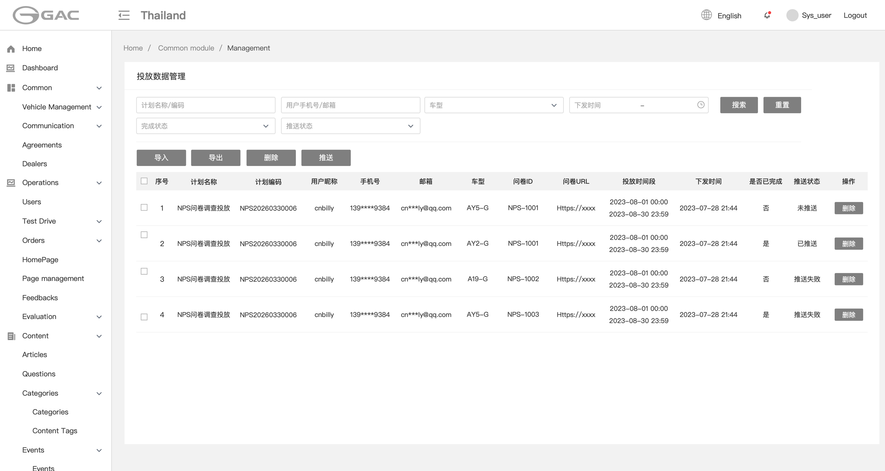
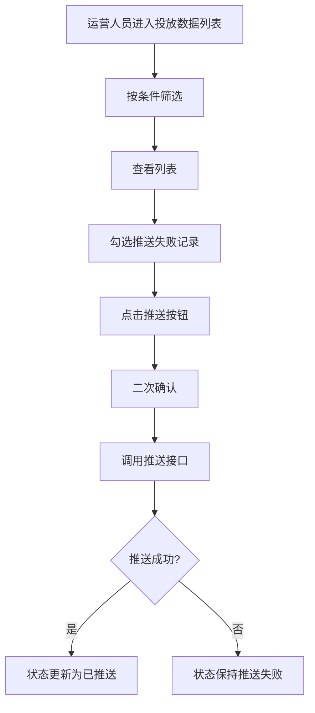
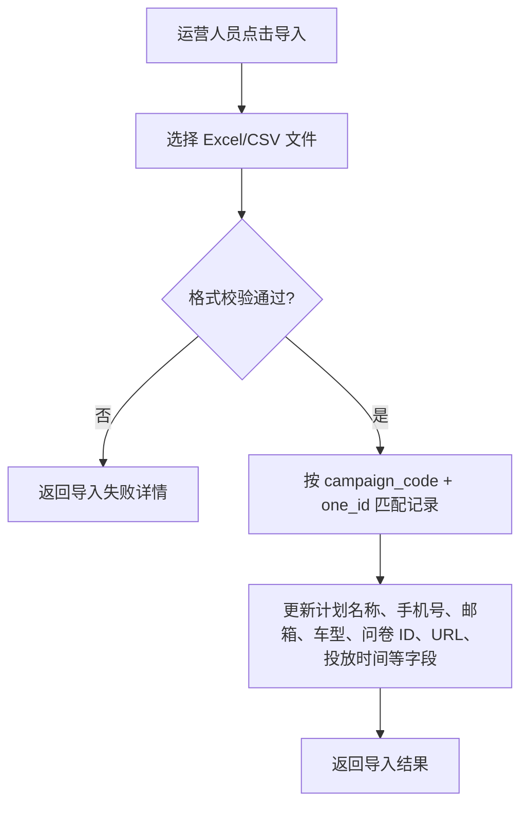
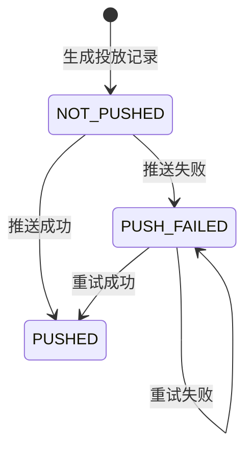

# §05.02 投放数据管理

> **层级**：平台层  
> **优先级**：P0  
> **实现技术**：运营管理后台（Vue 3 + Ant Design Vue）  
> **原型**：

---

## §05.02.1 功能概述

| 字段 | 内容 |
|------|------|
| 功能描述 | 运营管理后台查看与管理 NPS 问卷投放数据，支持按多维度筛选、导入更新、导出、手动推送至 CSI 以及删除操作。 |
| 用户故事 | 作为运营人员，我希望查看哪些用户已被下发问卷、是否完成、是否已成功推送 CSI，并能在推送失败时手动重试。 |
| 涉及角色 | 运营人员 |
| 前置条件 | 已存在投放计划并已执行过定时下发或导入生成投放记录。 |
| 后置条件 | 投放数据状态（完成状态、推送状态）与 CSI 保持一致；删除操作保留审计日志。 |
| 优先级 | P0 |
| 依赖功能 | 05.01 投放计划管理、05.03 定时下发任务 |

---

## §05.02.2 页面/界面描述

### 页面 C：投放数据列表

原型截图：

**页面状态**：

| 状态 | 触发条件 | 说明 |
|------|----------|------|
| 默认状态 | 首次进入 | 默认分页，20 条/页 |
| 空状态 | 无投放数据 | 显示空状态 |
| 批量选中 | 勾选行 | 顶部显示批量操作栏 |

**页面元素清单**：

| 编号     | 元素名称     | 类型        | 默认值 | 约束/校验规则 | 交互行为        | i18n key                                | 说明                                                                    |
| ------ | -------- | --------- | --- | ------- | ----------- | --------------------------------------- | --------------------------------------------------------------------- |
| E-C-01 | 计划名称/编码  | Input     | 空   | 模糊搜索    | -           | `campaign_delivery.filter.name_code`    |                                                                       |
| E-C-02 | 用户手机号/邮箱 | Input     | 空   | 模糊搜索    | -           | `campaign_delivery.filter.user_contact` |                                                                       |
| E-C-03 | 车型       | Select    | 全部  | 枚举      | -           | `campaign_delivery.filter.model`        |                                                                       |
| E-C-04 | 下发时间范围   | DateRange | 空   | 可选      | -           | `campaign_delivery.filter.send_time`    |                                                                       |
| E-C-05 | 完成状态     | Select    | 全部  | 枚举      | -           | `campaign_delivery.filter.completed`    |                                                                       |
| E-C-06 | 推送状态     | Select    | 全部  | 枚举      | -           | `campaign_delivery.filter.push_status`  |                                                                       |
| E-C-07 | 导入按钮     | Button    | -   | -       | 上传文件        | `campaign_delivery.btn_import`          |                                                                       |
| E-C-08 | 导出按钮     | Button    | -   | -       | 导出当前筛选结果    | `campaign_delivery.btn_export`          |                                                                       |
| E-C-09 | 删除按钮     | Button    | -   | 需选中行    | 二次确认后删除     | `common.btn_delete`                     |                                                                       |
| E-C-10 | 推送按钮     | Button    | -   | 需选中行    | 推送选中记录至 CSI | `campaign_delivery.btn_push`            |                                                                       |
| E-C-11 | 投放数据表格   | Table     | -   | -       | 展示列表        | -                                       | 列：多选框、序号、计划名称、计划编码、用户昵称、手机号、邮箱、车型、问卷ID、问卷URL、投放时间段、下发时间、是否已完成、推送状态、操作 |
| E-C-12 | 操作-删除    | Button    | -   | -       | 单条删除        | `common.btn_delete`                     |                                                                       |

**列表字段说明**：

| 字段 | 说明 |
|------|------|
| 投放时间段 | 由 `start_time` 和 `end_time` 合并显示，格式如 `2026-07-01 00:00 ~ 2026-07-31 23:59` |
| 下发时间 | `send_time`，问卷实际下发的时间 |
| 是否已完成 | 是 / 否 |
| 推送状态 | 未推送 / 已推送 / 推送失败 |
| 手机号/邮箱 | 脱敏展示，如 `138****1234`、`a***@gmail.com` |

---

## §05.02.3 交互逻辑

### 主流程：查看与手动推送投放数据



### 导入流程



### 页面跳转关系

| 起始页 | 触发动作 | 目标页 | 携带参数 | 说明 |
|--------|----------|--------|----------|------|
| 投放数据列表 | 点击导入 | 文件上传弹窗 | - | 上传后刷新列表 |
| 投放数据列表 | 点击导出 | 文件下载 | 当前筛选条件 | 异步或同步导出 |

---

## §05.02.4 业务规则

- **BR-05.02-01** 投放数据列表默认按下发时间倒序排列；支持按计划名称/编码、用户手机号/邮箱、车型、下发时间、完成状态、推送状态筛选。（→ AC-05.02-01）
- **BR-05.02-02** 列表中的手机号、邮箱等敏感字段须脱敏展示；查看完整信息需 `user:view-sensitive:any` 权限。（→ AC-05.02-01）
- **BR-05.02-03** 投放时间段由 `start_time` 和 `end_time` 两个独立字段定义，与 `send_time`（下发时间）解耦，作为该用户可看到入口的时间依据。（→ AC-05.02-02）
- **BR-05.02-04** 导入功能根据文件中的 `campaign_code` + `one_id` 匹配现有投放记录，更新其计划名称、手机号、邮箱、车型、问卷 ID、问卷 URL、投放开始时间、投放结束时间等字段；匹配不到则跳过或报错，由后端系统参数控制（默认报错）。（→ AC-05.02-03）
- **BR-05.02-05** 导出字段为：计划名称、计划编码、用户 OneID、手机号、邮箱、车型、问卷 ID、问卷 URL、投放开始时间、投放结束时间、下发时间、是否已完成；导出文件格式为 Excel 或 CSV，大小限制 ≤ 10MB。（→ AC-05.02-04）
- **BR-05.02-06** 推送功能仅允许对推送状态为“未推送”或“推送失败”的记录执行；已推送记录不支持重复推送（除非业务明确允许）。（→ AC-05.02-05）
- **BR-05.02-07** 推送状态按结果流转：未推送 → 已推送；推送失败可再次手动/自动重试。（→ AC-05.02-06）
- **BR-05.02-08** 投放记录删除采用逻辑删除（`deleted = 1`），保留审计轨迹。（→ AC-05.02-07）

---

## §05.02.5 异常处理

| 编号 | 场景 | 触发条件 | 系统行为 | 用户提示 | 恢复方式 |
|------|------|----------|----------|----------|----------|
| EX-05.02-01 | 导入文件格式错误 | 文件列缺失、类型错误或必填字段为空 | 返回导入失败详情 | 提示“导入文件格式错误，请下载模板” | 按模板修正后重新导入 |
| EX-05.02-02 | 推送 CSI 失败 | 网络异常或 CSI 返回错误 | 标记推送失败，记录日志 | 列表显示“推送失败” | 运营手动重试或定时自动重试 |
| EX-05.02-03 | 重复推送已推送记录 | 用户勾选已推送记录 | 前端禁用或后端幂等忽略 | 提示“记录已推送” | 取消选择 |
| EX-05.02-04 | 导出数据量过大 | 超过系统单次导出上限 | 拒绝或转异步任务 | 提示“数据量过大，请缩小筛选范围” | 缩小范围后重试 |
| EX-05.02-05 | 导入文件大小超限 | 超过 10MB | 拒绝上传 | 提示“文件大小超过限制” | 拆分文件或压缩 |

---

## §05.02.6 数据对象

### CampaignDelivery（投放数据/记录）

| 字段       | 英文名              | 类型          | 必填  | 约束            | 说明                                |
| -------- | ---------------- | ----------- | --- | ------------- | --------------------------------- |
| ID       | id               | long        | 是   | 主键            |                                   |
| 计划 ID    | campaign_id      | long        | 是   | 外键            |                                   |
| 计划编码     | campaign_code    | string(64)  | 是   | 索引            |                                   |
| 用户 OneID | one_id           | string(64)  | 是   | 索引            | 用户唯一标识                            |
| 用户昵称     | user_nickname    | string(100) | 否   | -             | 由系统生成，不参与导入导出               |
| 手机号      | phone            | string(20)  | 否   | -             | 脱敏展示                              |
| 邮箱       | email            | string(100) | 否   | -             | 脱敏展示                              |
| 车型       | model            | string(64)  | 否   | -             | 下发时用户车型                           |
| URL ID   | url_code         | string(64)  | 是   | -             | 实际分配的问卷 ID                        |
| 问卷 URL   | url              | string(500) | 是   | -             | 实际分配的问卷地址                         |
| 下发时间     | send_time        | datetime    | 是   | 索引            | 问卷实际下发的时间                         |
| 投放开始时间   | start_time       | datetime    | 是   | -             | 投放时间段的起始时间                        |
| 投放结束时间   | end_time         | datetime    | 是   | -             | 投放时间段的结束时间                        |
| 是否完成     | completed        | boolean     | 是   | 默认 false      |                                   |
| 推送状态     | push_status      | enum        | 是   | 默认 NOT_PUSHED | NOT_PUSHED / PUSHED / PUSH_FAILED |
| 删除标记     | deleted          | tinyint     | 是   | 默认 0          | 逻辑删除                              |
| 创建时间     | created_at       | datetime    | 是   | -             |                                   |
| 更新时间     | updated_at       | datetime    | 是   | -             |                                   |

### 导入文件模板

> 注：`campaign_name` 来自关联的 `Campaign` 实体，非 `CampaignDelivery` 直接字段。

| 字段 | 英文名 | 必填 | 说明 |
|------|--------|------|------|
| 计划名称 | campaign_name | 是 | 用于匹配投放计划 |
| 计划编码 | campaign_code | 是 | 用于匹配投放计划 |
| 用户 OneID | one_id | 是 | 用于匹配用户投放记录 |
| 手机号 | phone | 否 | 用户手机号 |
| 邮箱 | email | 否 | 用户邮箱 |
| 车型 | model | 否 | 用户车型 |
| 问卷 ID | url_code | 是 | 更新后的问卷 ID |
| 问卷 URL | url | 是 | 更新后的问卷 URL |
| 投放开始时间 | start_time | 是 | 投放时间段的起始时间 |
| 投放结束时间 | end_time | 是 | 投放时间段的结束时间 |

### 导出文件模板

| 字段 | 英文名 | 说明 |
|------|--------|------|
| 计划名称 | campaign_name | 投放计划名称 |
| 计划编码 | campaign_code | 投放计划编码 |
| 用户 OneID | one_id | 用户唯一标识 |
| 手机号 | phone | 脱敏展示 |
| 邮箱 | email | 脱敏展示 |
| 车型 | model | 用户车型 |
| 问卷 ID | url_code | 实际分配的问卷 ID |
| 问卷 URL | url | 实际分配的问卷地址 |
| 投放开始时间 | start_time | 投放时间段的起始时间 |
| 投放结束时间 | end_time | 投放时间段的结束时间 |
| 下发时间 | send_time | 问卷实际下发的时间 |
| 是否已完成 | completed | 是 / 否 |

---

## §05.02.7 状态机

### 投放数据推送状态



**状态转换规则**：

| 当前状态 | 目标状态 | 触发动作 | 允许角色/系统 | 副作用 |
|----------|----------|----------|---------------|--------|
| NOT_PUSHED | PUSHED | 自动/手动推送成功 | 定时任务/运营 | 更新状态 |
| NOT_PUSHED | PUSH_FAILED | 推送失败 | 定时任务/运营 | 记录失败日志 |
| PUSH_FAILED | PUSHED | 手动重试成功 | 运营 | 更新状态 |
| PUSH_FAILED | PUSH_FAILED | 手动重试失败 | 运营 | 保留失败状态 |

---

## §05.02.8 通知/消息触发

| 触发事件 | 接收人 | 通知方式 | 通知内容模板 | i18n key | 延迟 |
|----------|--------|----------|-------------|----------|------|
| 投放数据批量推送失败 | 运营人员 | 管理后台站内通知 / 邮件 | “{count} 条投放数据推送 CSI 失败，请及时重试” | `campaign.notify.push_failed` | 实时 |
| 投放数据导入完成 | 运营人员 | 管理后台 Toast | “导入成功 {success} 条，失败 {fail} 条” | `campaign.notify.import_result` | 实时 |

---

## §05.02.9 验收标准

### 正常流程

- **AC-05.02-01**: **Given** 存在多条投放记录，**When** 运营人员进入投放数据列表，**Then** 列表按下发时间倒序展示，手机号/邮箱脱敏，支持多维度筛选。（← BR-05.02-01, BR-05.02-02）
- **AC-05.02-02**: **Given** 列表中展示某用户投放记录，**When** 查看投放时间段，**Then** 显示为 `start_time ~ end_time`，两个字段独立存储。（← BR-05.02-03）
- **AC-05.02-03**: **Given** 运营人员上传合规的导入文件，**When** 点击导入，**Then** 系统按 `campaign_code + one_id` 匹配并更新对应记录的计划名称、手机号、邮箱、车型、问卷 ID、问卷 URL、投放开始时间、投放结束时间，返回成功/失败条数。（← BR-05.02-04）
- **AC-05.02-04**: **Given** 运营人员设置筛选条件，**When** 点击导出，**Then** 系统导出包含计划名称、计划编码、用户 OneID、手机号、邮箱、车型、问卷 ID、问卷 URL、投放开始时间、投放结束时间、下发时间、是否已完成的 Excel/CSV 文件。（← BR-05.02-05）
- **AC-05.02-05**: **Given** 运营人员勾选推送失败记录，**When** 点击推送，**Then** 系统仅对未推送或推送失败记录执行推送。（← BR-05.02-06）
- **AC-05.02-06**: **Given** 推送失败记录被手动重试，**When** 推送成功，**Then** 状态更新为“已推送”；失败则保持“推送失败”。（← BR-05.02-07）

### 异常流程

- **AC-05.02-07**: **Given** 运营人员上传格式错误的导入文件，**When** 点击导入，**Then** 系统拒绝并提示“导入文件格式错误，请下载模板”。（← EX-05.02-01）
- **AC-05.02-08**: **Given** 推送 CSI 接口超时，**When** 手动推送，**Then** 系统标记为推送失败并记录日志，允许再次重试。（← EX-05.02-02）

### 边界测试

- **AC-05.02-09**: **Given** 运营人员勾选包含已推送记录的混合批次，**When** 点击推送，**Then** 系统跳过已推送记录，仅推送未推送/失败记录，并给出提示。（← BR-05.02-06）

---

## §05.02.10 API 契约

### 接口清单

| 接口       | 方法     | 路径                                          | 主要参数                     | 返回     | 说明   |
| -------- | ------ | ------------------------------------------- | ------------------------ | ------ | ---- |
| 投放数据列表   | GET    | `/api/v1/admin/campaigns/deliveries`        | page, page_size, filters | PageVO | 管理后台 |
| 导入投放数据   | POST   | `/api/v1/admin/campaigns/deliveries/import` | file                     | 导入结果   | 管理后台 |
| 导出投放数据   | POST   | `/api/v1/admin/campaigns/deliveries/export` | filters                  | 文件流    | 管理后台 |
| 手动推送 CSI | POST   | `/api/v1/admin/campaigns/deliveries/push`   | deliveryIds[]            | 推送结果   | 管理后台 |
| 删除投放数据   | DELETE | `/api/v1/admin/campaigns/deliveries/{id}`   | -                        | -      | 逻辑删除 |

### §05.02.10.1 手动推送 CSI

**请求**：

```http
POST /api/v1/admin/campaigns/deliveries/push
Authorization: Bearer {jwt}
Content-Type: application/json

{
  "deliveryIds": [12345, 12346, 12347]
}
```

**响应（成功）**：

```json
{
  "code": 0,
  "message": "success",
  "data": {
    "total": 3,
    "success": 3,
    "failed": 0
  },
  "traceId": "trace-nps-005",
  "timestamp": 1751328000000
}
```

**响应（部分失败）**：

```json
{
  "code": 0,
  "message": "partial success",
  "data": {
    "total": 3,
    "success": 1,
    "failed": 2,
    "failedIds": [12346, 12347]
  },
  "traceId": "trace-nps-006",
  "timestamp": 1751328000000
}
```

### §05.02.10.2 导入投放数据

**请求**：

```http
POST /api/v1/admin/campaigns/deliveries/import
Authorization: Bearer {jwt}
Content-Type: multipart/form-data

file=@campaign_delivery_update.xlsx
```

**响应（成功）**：

```json
{
  "code": 0,
  "message": "success",
  "data": {
    "total": 100,
    "success": 98,
    "failed": 2,
    "failReasons": [
      { "row": 5, "reason": "campaign_code not found" },
      { "row": 12, "reason": "one_id not found" }
    ]
  },
  "traceId": "trace-nps-007",
  "timestamp": 1751328000000
}
```

**响应（错误 - 文件格式错误）**：

```json
{
  "code": 4103,
  "message": "Import file format error",
  "data": {
    "requiredColumns": ["campaign_name", "campaign_code", "one_id", "phone", "email", "model", "url_code", "url", "start_time", "end_time"]
  },
  "traceId": "trace-nps-008",
  "timestamp": 1751328000000
}
```
