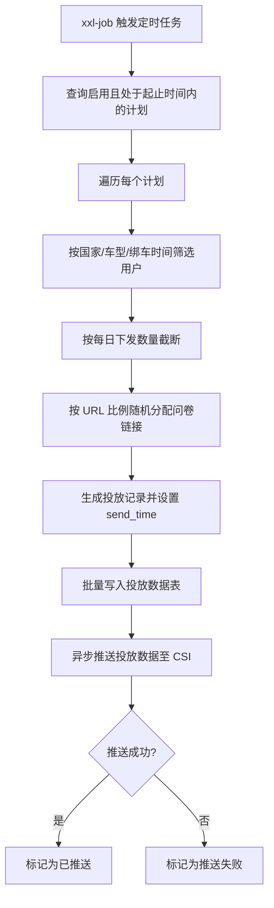
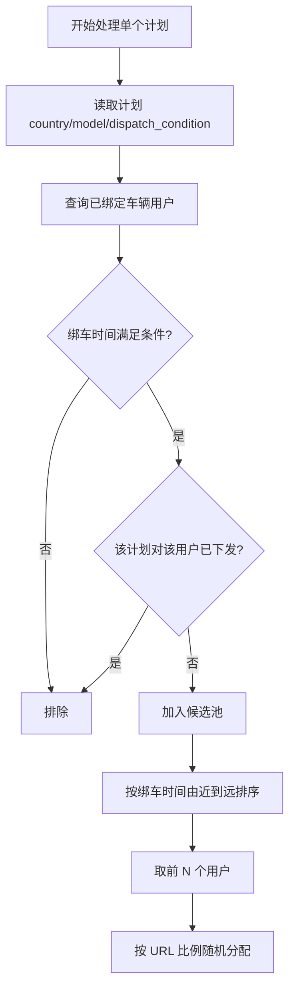

# §05.03 定时下发任务

> **层级**：平台层  
> **优先级**：P0  
> **实现技术**：服务端（Spring Boot + xxl-job）  
> **说明**：本模块无前端页面，为后台定时任务与数据同步逻辑。

---

## §05.03.1 功能概述

| 字段 | 内容 |
|------|------|
| 功能描述 | 每日凌晨按投放计划配置，筛选符合条件的车主用户，按比例分配问卷链接并生成投放记录；随后将投放数据异步回传至 CSI 系统。 |
| 用户故事 | 作为运营人员，我希望系统在指定时间自动完成问卷投放，无需人工干预；作为系统，我希望投放数据能自动回流 CSI 形成闭环。 |
| 涉及角色 | 系统定时任务、CSI 系统、UOP |
| 前置条件 | 已存在启用状态且处于起止时间内的投放计划；用户服务与车辆服务可用。 |
| 后置条件 | 生成用户级投放记录；投放数据推送至 CSI（成功或标记失败待重试）。 |
| 优先级 | P0 |
| 依赖功能 | 05.01 投放计划管理 |

---

## §05.03.2 页面/界面描述

> 本模块为纯服务端定时任务，无前端页面。运营管理后台可通过投放数据列表查看任务执行结果（推送状态、下发时间等）。

---

## §05.03.3 交互逻辑

### 主流程：定时下发任务



### 子流程：用户筛选与 URL 分配



---

## §05.03.4 业务规则

- **BR-05.03-01** 定时任务每日凌晨执行一次，具体时刻可配置（默认 02:00），支持 xxl-job 分片执行避免单点瓶颈。（→ AC-05.03-01）
- **BR-05.03-02** 仅处理“启用状态”且当前日期在起止时间范围内的投放计划；停用或超期的计划跳过。（→ AC-05.03-02）
- **BR-05.03-03** 按计划的 `country`、`model` 以及 `dispatch_condition`（绑车满 3 个月/6 个月）筛选用户；未绑定车辆或车型不匹配的用户跳过。（→ AC-05.03-03）
- **BR-05.03-04** 候选用户按绑车时间由近到远排序，按计划的 `daily_dispatch_limit` 截断取前 N 名。（→ AC-05.03-04）
- **BR-05.03-05** 对截断后的用户按 URL 配置的比例随机分配问卷链接，各 URL 分配人数尽量接近配置比例；同一投放计划对同一用户仅生成一条记录。（→ AC-05.03-05）
- **BR-05.03-06** 投放记录生成时设置 `send_time` 为任务触发时的实际时间；`start_time` 为投放开始时间；`end_time` 为投放结束时间，由 `start_time + display_duration_days` 计算得出。（→ AC-05.03-06）
- **BR-05.03-07** 投放记录生成后，系统异步调用 CSI/UOP 投放数据同步接口；推送失败时标记 `PUSH_FAILED` 并记录日志，支持后续自动/手动重试。（→ AC-05.03-07）
- **BR-05.03-08** 若某计划当日无符合条件的用户，则不生成任何记录，任务正常结束。（→ AC-05.03-08）

---

## §05.03.5 异常处理

| 编号 | 场景 | 触发条件 | 系统行为 | 用户提示 | 恢复方式 |
|------|------|----------|----------|----------|----------|
| EX-05.03-01 | 用户服务/车辆服务不可用 | Feign 调用超时或失败 | 跳过依赖服务，记录 WARN 日志 | 无 | 服务恢复后次日任务自动恢复 |
| EX-05.03-02 | CSI 投放数据同步超时 | 推送接口超时 | 标记 PUSH_FAILED，进入重试队列 | 管理后台列表显示“推送失败” | 自动重试或运营手动重试 |
| EX-05.03-03 | URL 比例配置异常 | 比例之和不等于 100% | 该计划跳过，记录错误日志 | 无 | 运营在后台修正后次日生效 |
| EX-05.03-04 | 计划配置缺失关键字段 | country/model/start_time 等为空 | 该计划跳过 | 无 | 运营补全配置 |
| EX-05.03-05 | 数据库写入部分失败 | 批量插入异常 | 事务回滚，记录 ERROR 日志 | 无 | 排查数据库后重跑任务 |

---

## §05.03.6 数据对象

> 本模块复用 05.01 与 05.02 定义的实体：`Campaign`、`CampaignUrl`、`CampaignDelivery`。

### 定时任务关键字段说明

| 实体 | 字段 | 说明 |
|------|------|------|
| Campaign | enabled | 仅启用计划参与下发 |
| Campaign | start_time / end_time | 仅当前日期在此范围内的计划参与 |
| Campaign | country / model | 筛选用户维度 |
| Campaign | dispatch_condition | 绑车时长条件 |
| Campaign | daily_dispatch_limit | 每日最大下发用户数 |
| Campaign | display_duration_days | 计算用户投放结束时间 |
| CampaignUrl | url_code / url / percentage | 按比例分配问卷链接 |
| CampaignDelivery | send_time | 问卷下发时间 |
| CampaignDelivery | start_time | 投放开始时间 |
| CampaignDelivery | end_time | 投放结束时间 |
| CampaignDelivery | push_status | 同步 CSI 状态 |

---

## §05.03.7 状态机

> 本模块涉及的状态机已在 05.02 投放数据管理中定义（推送状态：NOT_PUSHED / PUSHED / PUSH_FAILED）。

---

## §05.03.8 通知/消息触发

| 触发事件 | 接收人 | 通知方式 | 通知内容模板 | i18n key | 延迟 |
|----------|--------|----------|-------------|----------|------|
| 定时任务整体失败 | 运维/运营 | 告警邮件 / 企业微信 | “定时下发任务执行失败，请排查” | `campaign.notify.job_failed` | 实时 |
| 大规模推送失败 | 运营 | 站内通知 | “{count} 条投放数据推送 CSI 失败，请及时重试” | `campaign.notify.push_failed` | 实时 |

---

## §05.03.9 验收标准

### 正常流程

- **AC-05.03-01**: **Given** 到达配置的执行时间，**When** xxl-job 触发定时任务，**Then** 任务正常启动并按计划执行。（← BR-05.03-01）
- **AC-05.03-02**: **Given** 存在启用且处于起止时间内的计划，**When** 定时任务执行，**Then** 该计划参与下发；停用或超期计划不参与。（← BR-05.03-02）
- **AC-05.03-03**: **Given** 计划配置了下发条件，**When** 任务筛选用户，**Then** 仅绑车时间满足条件的用户进入候选池。（← BR-05.03-03）
- **AC-05.03-04**: **Given** 候选用户数量超过每日下发数量，**When** 任务截断，**Then** 按绑车时间由近到远取前 N 名用户。（← BR-05.03-04）
- **AC-05.03-05**: **Given** 截断后用户已确定，**When** 分配问卷链接，**Then** 按 URL 比例分配且同一计划对同一用户仅生成一条记录。（← BR-05.03-05）
- **AC-05.03-06**: **Given** 投放记录已生成，**When** 查看投放时间段，**Then** `end_time` 等于 `start_time + display_duration_days`，`send_time` 为任务触发时的实际时间。（← BR-05.03-06）
- **AC-05.03-07**: **Given** 投放记录已生成，**When** 异步推送至 CSI，**Then** 成功则标记 PUSHED，失败则标记 PUSH_FAILED。（← BR-05.03-07）

### 异常流程

- **AC-05.03-08**: **Given** 用户服务/车辆服务调用失败，**When** 定时任务执行到该步骤，**Then** 跳过受影响用户并记录日志，不影响其他用户。（← EX-05.03-01）
- **AC-05.03-09**: **Given** CSI 同步接口超时，**When** 异步推送，**Then** 标记 PUSH_FAILED 并进入重试队列。（← EX-05.03-02）

### 边界测试

- **AC-05.03-10**: **Given** 某计划 URL 比例之和不等于 100%，**When** 定时任务处理到该计划，**Then** 跳过该计划并记录错误，其他计划正常执行。（← EX-05.03-03）
- **AC-05.03-11**: **Given** 某计划当日无符合条件的用户，**When** 定时任务执行，**Then** 该计划不生成记录，任务正常结束。（← BR-05.03-08）

---

## §05.03.10 API 契约

### 接口清单

| 接口 | 方法 | 路径 | 主要参数 | 返回 | 说明 |
|------|------|------|----------|------|------|
| 投放数据同步 | POST | `/api/v1/campaigns/deliveries/sync` | delivery 字段 | - | App → CSI（UOP） |

### §05.03.10.1 投放数据同步（App 服务端 → CSI / UOP）

**请求**：

```http
POST /api/v1/campaigns/deliveries/sync
Content-Type: application/json
X-Internal-Key: {internal_key}

{
  "country": "THA",
  "campaignCode": "NPS20260001",
  "campaignName": "问卷调查投放-AION V",
  "oneId": "one192929293939",
  "model": "AY5-G",
  "urlCode": "NPS-1007",
  "url": "https://csi.example.com/survey/1007",
  "sendTime": "2026-07-01T10:00:00+00:00"
}
```

**响应（成功）**：

```json
{
  "code": 0,
  "message": "success",
  "data": null,
  "traceId": "trace-nps-009",
  "timestamp": 1751328000000
}
```

**响应（错误 - UOP 超时）**：

```http
HTTP/1.1 504 Gateway Timeout
```

App 服务端将该记录标记为 `PUSH_FAILED`，允许后续重试。
