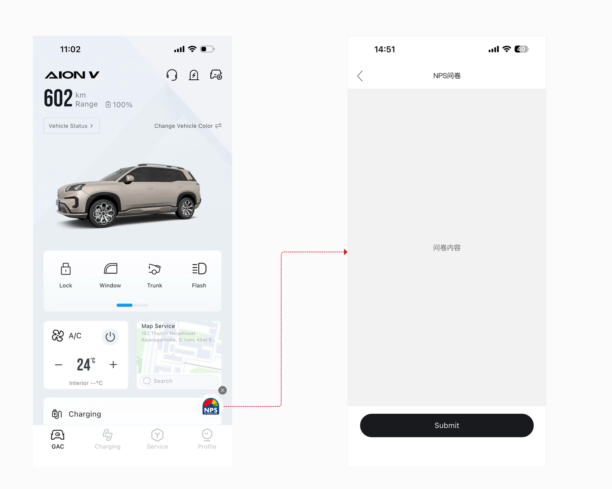
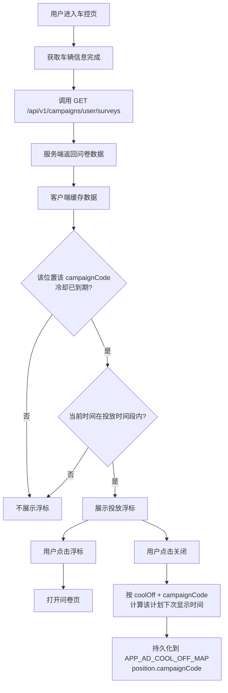

# §05.04 App 问卷入口

> **层级**：车主端业务层  
> **优先级**：P0  
> **实现技术**：Flutter 原生  
---

## §05.04.1 功能概述

| 字段 | 内容 |
|------|------|
| 功能描述 | 在 GAC APP 车控页右下角以浮标形式展示 NPS 问卷入口；支持用户关闭入口，并按冷却规则控制再次显示。 |
| 用户故事 | 作为车主用户，我希望在合适的时间、以不打扰的方式看到问卷入口，并可以临时关闭它。 |
| 涉及角色 | 车主用户 |
| 前置条件 | 用户已登录 GAC APP 并已获取车辆信息；服务端存在该用户的有效投放记录。 |
| 后置条件 | 用户点击浮标后跳转至问卷页；关闭后本地持久化下次可显示时间。 |
| 优先级 | P0 |
| 依赖功能 | 05.01 投放计划管理、05.03 定时下发任务 |

---

## §05.04.2 页面/界面描述

### 页面 D：车控页问卷入口

原型截图：

**页面状态**：

| 状态 | 触发条件 | 说明 |
|------|----------|------|
| 默认状态 | 进入车控页 | 根据规则判断是否展示浮标 |
| 展示状态 | 满足显示规则 | 右下角显示 圆形图标 |
| 隐藏状态 | 不满足返回规则或处于冷却期 | 不显示浮标 |
| 关闭后 | 用户点击 × | 浮标消失，写入 coolOff |

**页面元素清单**：

| 编号 | 元素名称 | 类型 | 默认值 | 约束/校验规则 | 交互行为 | i18n key | 说明 |
|------|----------|------|--------|---------------|----------|----------|------|
| E-D-01 | NPS 浮标 | FloatingButton | 隐藏 | 按返回规则与显示规则 | 点击进入问卷页 | `campaign.entry.label` | 车控页右下角圆形图标 |
| E-D-02 | 关闭按钮 | IconButton | - | - | 点击后按 coolOff 计算下次显示时间 | `campaign.entry.close` | 浮标右上角 × |

**布局说明**：
- 浮标位于车控页右下角，距离屏幕边缘 20px，避让底部安全区。
- 浮标直径 60px，圆角完全圆角，显示入口图片或默认 NPS 文案。
- 关闭按钮位于浮标左上角，直径 20xpx，点击区域 ≥ 44×44pt。

---

## §05.04.3 交互逻辑

### 主流程：进入车控页 → 判断是否展示浮标



### 显示规则判断

```mermaid
flowchart TD
    P[判断是否展示浮标] --> Q{该 position 下该 campaignCode<br/>已永久关闭?}
    Q -->|是| R[不展示]
    Q -->|否| S{当前时间 < APP_AD_COOL_OFF_MAP<br/>[position][campaignCode] 到期时间?}
    S -->|是| R
    S -->|否| T{当前时间在用户投放时间段内?}
    T -->|否| R
    T -->|是| U{该用户该计划未完成?}
    U -->|否| R
    U -->|是| V[展示浮标]
```

### 页面跳转关系

| 起始页 | 触发动作      | 目标页 | 携带参数                                               | 说明         |
| --- | --------- | --- | -------------------------------------------------- | ---------- |
| 车控页 | 点击 NPS 浮标 | 问卷页 | survey URL（已含 ?oneId=xxx&campaignCode=xxx 参数）、position | WebView 打开 |
| 车控页 | 点击关闭      | 车控页 | -                                                  | 浮标隐藏       |

---

## §05.04.4 业务规则

- **BR-05.04-01** 客户端在获取车辆信息完成后调用问卷查询接口，查询当前用户的有效问卷数据；返回的 `url` 已由后端拼接 `?oneId=xxx&campaignCode=xxx`（或 `&oneId=xxx&campaignCode=xxx`，视原始 URL 是否已有 query string 而定）参数。可返回多条不同位置的投放记录。（→ AC-05.04-01）
- **BR-05.04-02** 问卷数据返回规则需同时满足：投放计划处于启用状态、当前用户存在已下发且未完成的问卷、当前时间在用户投放时间段内。投放计划停用后，其投放记录（含停用前已下发）不再返回，App 端不再展示对应入口（停用规则详见 BR-05.01-05）。（→ AC-05.04-02, AC-05.04-10）
- **BR-05.04-03** 问卷入口显示规则：服务端返回了问卷数据、本地 coolOff 时间已到期。（→ AC-05.04-03）
- **BR-05.04-04** 客户端以展示位置 + 投放计划编码为维度，在本地持久化存储每个计划在各位置的下次可显示时间戳。Key 为 `APP_AD_COOL_OFF_MAP`，Value 为 JSON 字符串 `{"position": {"campaignCode": timestamp}}`，每个位置下按 `campaignCode` 分别存储独立的冷却到期时间。（→ AC-05.04-04）
- **BR-05.04-05** 用户关闭浮标时，根据接口返回的 `cool_off`（单位小时）和 `campaign_code` 计算该计划在该位置的下次可显示时间：`next_show_time = now + cool_off_hours * 3600 * 1000`，写入 `APP_AD_COOL_OFF_MAP[position][campaignCode]`；`cool_off = 0` 表示该计划在该位置永久不再显示。（→ AC-05.04-05）
- **BR-05.04-06** 用户完成问卷或投放时间段过期后，对应投放记录不再返回，浮标自动隐藏。（→ AC-05.04-06）
- **BR-05.04-07** 同一位置存在多条不同投放计划的问卷时，各计划按各自独立的 `campaignCode` 冷却时间控制显示；关闭某计划后仅影响该计划，其他计划不受影响。客户端判断显示时需检查该位置当前计划的 `campaignCode` 对应冷却时间是否已到期。（→ AC-05.04-07）

---

## §05.04.5 异常处理

| 编号 | 场景 | 触发条件 | 系统行为 | 用户提示 | 恢复方式 |
|------|------|----------|----------|----------|----------|
| EX-05.04-01 | 问卷查询接口失败 | 网络异常或服务端错误 | 使用本地缓存或隐藏浮标 | 无 | 网络恢复后下次进入车控页重试 |
| EX-05.04-02 | 本地存储读取失败 | 存储损坏或权限问题 | 按无 coolOff 处理，允许展示 | 无 | 重启 App 后恢复 |
| EX-05.04-03 | 浮标图片加载失败 | URL 无效或网络问题 | 显示默认 NPS 文案 | 无 | 网络恢复后重新加载 |
| EX-05.04-04 | pic 为空或缺失 | 服务端未返回 pic 字段 | 显示默认 NPS 图标+文案 `campaign.entry.label` | 无 | 无需恢复 |

---

## §05.04.6 数据对象

### CampaignSurveyVO（客户端问卷数据）

| 字段 | 英文名 | 类型 | 必填 | 约束 | 说明 |
|------|--------|------|------|------|------|
| 计划编码 | campaign_code | string | 是 | - | |
| 入口图片 | pic | string | 否 | URL | |
| 车型 | model | string | 否 | - | |
| 问卷 URL | url | string | 是 | URL | 已由后端拼接 ?oneId=xxx&campaignCode=xxx 参数 |
| 冷却时长 | cool_off | string | 是 | - | 单位小时（序列化自 INT 字段）；"0" 表示永久不显示 |
| 投放开始时间 | start_time | datetime | 是 | - | 用户维度 |
| 投放结束时间 | end_time | datetime | 是 | - | 用户维度 |
| 展示位置 | position | string | 是 | - | 如 REMOTE_CONTROL_RIGHT_BOTTOM |

### 本地存储

| Key | 类型 | 说明 |
|-----|------|------|
| `APP_AD_COOL_OFF_MAP` | JSON String | 按位置及投放计划存储冷却到期时间戳（毫秒）。结构：`{"position": {"campaignCode": timestamp}}`。示例：`{"REMOTE_CONTROL_RIGHT_BOTTOM": {"NPS20260330006": 1782921685000}, "SHOWROOM_POPUP": {"NPS20260330006": 1782921599000}}` |

---

## §05.04.7 状态机

> 本模块无独立实体状态机；浮标展示状态由服务端返回规则 + 本地 coolOff 共同决定，为运行时计算状态。

---

## §05.04.8 通知/消息触发

| 触发事件 | 接收人 | 通知方式 | 通知内容模板 | i18n key | 延迟 |
|----------|--------|----------|-------------|----------|------|
| 暂无 | - | - | - | - | - |

---

## §05.04.9 验收标准

### 正常流程

- **AC-05.04-01**: **Given** 用户进入车控页且车辆信息已获取，**When** 客户端调用问卷查询接口，**Then** 服务端返回该用户当前有效的问卷数据列表。（← BR-05.04-01）
- **AC-05.04-02**: **Given** 当前用户存在已下发且未完成的问卷，且当前时间在其投放时间段内，**When** 查询接口被调用，**Then** 返回对应问卷数据。（← BR-05.04-02）
- **AC-05.04-03**: **Given** 客户端已获得问卷数据且该位置该 `campaignCode` 的冷却已到期，**When** 进入车控页，**Then** 在指定位置展示投放浮标。（← BR-05.04-03）
- **AC-05.04-04**: **Given** 用户关闭浮标，**When** 客户端处理关闭事件，**Then** 按 `cool_off` 和 `campaignCode` 计算并持久化该计划在该位置的下次可显示时间到 `APP_AD_COOL_OFF_MAP[position][campaignCode]`。（← BR-05.04-04, BR-05.04-05）
- **AC-05.04-05**: **Given** 用户点击 NPS 浮标，**When** 浮标被点击，**Then** 打开问卷页并传入问卷 URL 与相关参数。（← BR-05.04-03）
- **AC-05.04-06**: **Given** 用户已完成问卷或投放时间段已过期，**When** 再次进入车控页，**Then** 不再展示对应浮标。（← BR-05.04-06）

### 异常流程

- **AC-05.04-07**: **Given** 问卷查询接口返回失败，**When** 客户端处理失败，**Then** 不展示浮标或沿用本地缓存，不阻塞车控页主流程。（← EX-05.04-01）

### 边界测试

- **AC-05.04-08**: **Given** 计划的 `cool_off` 配置为”关闭后不再显示”，**When** 用户关闭浮标，**Then** 该位置后续不再展示该 `campaignCode` 对应的入口，其他计划不受影响。（← BR-05.04-05）
- **AC-05.04-09**: **Given** 同一位置存在两条不同 `campaignCode` 的有效问卷，**When** 用户关闭第一条，**Then** 仅更新该计划在该位置的冷却时间，第二条仍按其自身的冷却状态判断是否展示。（← BR-05.04-07）
- **AC-05.04-10**: **Given** 投放计划已被停用，且当前用户存在该计划已下发且未完成的问卷，**When** 问卷查询接口被调用，**Then** 返回数据中不包含该计划的问卷数据，App 端不展示该计划的入口浮标。（← BR-05.04-02）

---

## §05.04.10 API 契约

### 接口清单

| 接口 | 方法 | 路径 | 主要参数 | 返回 | 说明 |
|------|------|------|----------|------|------|
| 用户问卷查询 | GET | `/api/v1/campaigns/user/surveys` | - | CampaignSurveyVO[] | App 客户端 |

### §05.04.10.1 用户问卷查询（App 客户端 → App 服务端）

**请求**：

```http
GET /api/v1/campaigns/user/surveys
Authorization: Bearer {jwt}
```

**响应（成功）**：

```json
{
  "code": 0,
  "message": "success",
  "data": [
    {
      "campaignCode": "NPS20260330006",
      "pic": "https://cdn.example.com/campaign/icon.png",
      "model": "AY5-G",
      "url": "https://csi.example.com/survey/1007?oneId=one192929293939&campaignCode=NPS20260330006",
      "coolOff": "24",
      "startTime": "2026-07-01T10:00:00+00:00",
      "endTime": "2026-07-31T10:00:00+00:00",
      "position": "REMOTE_CONTROL_RIGHT_BOTTOM"
    }
  ],
  "traceId": "trace-nps-010",
  "timestamp": 1751328000000
}
```

**响应（成功 - 无问卷）**：

```json
{
  "code": 0,
  "message": "success",
  "data": [],
  "traceId": "trace-nps-011",
  "timestamp": 1751328000000
}
```

**响应（错误 - 未登录）**：

```json
{
  "code": 2001,
  "message": "Unauthorized",
  "data": null,
  "traceId": "trace-nps-012",
  "timestamp": 1751328000000
}
```
