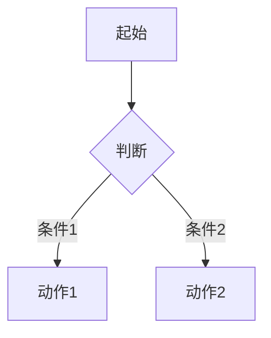
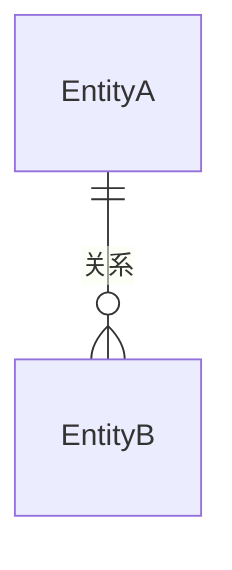
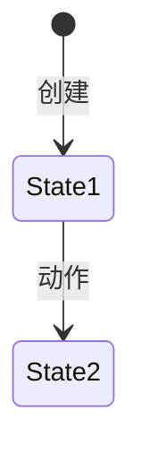

# [产品名称] 产品需求文档（PRD）

> **使用说明**：本文件为结构化 PRD 模板标准，可直接复制使用。模板设计理念见 `_archive/session-log-2026-04-25.md` 阶段一。
>
> **文件命名约定**：多模块项目使用 `00-总览.md`、`05.01-xxx.md`、`05.02-xxx.md`，文件名前导 0 仅用于排序；文档内部及交叉引用使用 `5.1`、`BR-5.1-01`、`AC-5.1-01` 形式（不带前导 0）。
>
> **AI 消费约定**：
> - 所有路径建议写**仓库根目录相对路径**，避免 AI 因当前工作目录不同而误读
> - 每个 5.x 模块顶部 front matter 必须完整，作为 AI 选择上下文的第一入口
> - 页面元素表中的 `i18n key` 列对前端页面为必填；若暂无 key，需显式标注 `需新增`
> - 未关闭的 Open Question 必须标注「是否阻塞开发」与「临时默认策略」
> - Permission Code、错误码、状态枚举若单独维护在技术方案/注册表中，PRD 中必须写明单一真相源位置
> - 若存在独立任务清单，建议在任务清单中直接写明 AI 使用步骤、输入文档别名和角色补读建议
>
> **裁剪原则**：
> - **P0/P1 功能**：所有子节必填
> - **P2/P3 功能**：5.x.1（概述）、5.x.3（流程）、5.x.4（业务规则）、5.x.5（异常处理）、5.x.6（数据对象）、5.x.9（验收标准）必填，其余可选
> - 状态机仅当实体有 ≥3 个状态时填写
> - API 契约 PM 可不填，留给开发者在技术方案中定义；但若填写，必须包含 sample payload
> - **5.x.5（异常处理）任何优先级都必填**——异常路径无论需求轻重都不能省
>
> **冲突优先级**：当 Mermaid 流程图与表格/规则描述不一致时，以表格/规则文字描述为准；当 PRD 与 技术架构 在数值参数（大小、超时、重试）上冲突时，以 PRD 为准（PRD 优先级 > 技术文档）。

---

## 1. 产品概述

| 字段 | 内容 |
|------|------|
| 产品名称 | |
| 版本号 | V1.0 |
| 文档版本 | 1.0.0 |
| 最后更新日期 | YYYY-MM-DD |
| 作者 | |
| 审核人 | |
| 文档状态 | 草稿 |

**产品定位**：

<!-- 一句话描述产品是什么、为谁服务、核心价值 -->

**目标用户**：

<!-- 列出主要目标用户群体及其特征 -->

**核心问题**：

<!-- 产品要解决的 1-3 个核心问题 -->

1.
2.
3.

**产品目标**：

<!-- 可量化的目标 -->

-

### 1.1 范围与边界

| 类别 | 内容 |
|------|------|
| 本版本范围（In Scope） | |
| 不在范围内（Out of Scope） | |
| 未来版本规划（Future） | |

### 1.2 假设与约束

**假设**：
-

**约束**：
-

### 1.3 外部依赖与集成

| 外部系统 | 集成方式 | 用途 | SLA / 降级策略 | 说明 |
|----------|----------|------|---------------|------|
| | | | | |

### 1.4 竞品参考（可选）

| 竞品 | 参考点 | 我们的差异 |
|------|--------|-----------|
| | | |

### 1.5 版本变更记录

| 版本 | 日期 | 修改人 | 变更内容 |
|------|------|--------|----------|
| 1.0.0 | YYYY-MM-DD | | 初始版本 |

---

## 2. 术语表

| 术语 | 英文 | 定义 | 备注 |
|------|------|------|------|
| | | | |

**命名规范**：
- 实体/类名：PascalCase（如 `Question`、`UserProfile`）
- 字段/属性名：snake_case（如 `created_at`、`vote_score`）
- 枚举/常量值：UPPER_SNAKE_CASE（如 `PUBLISHED`、`MAX_RETRY`）
- URL 路径：kebab-case（如 `/user-profile`）

---

## 3. 用户角色与权限

### 3.1 角色定义

| 角色 | 说明 | 获取方式 |
|------|------|----------|
| | | |

### 3.2 权限矩阵

| 操作 | 角色A | 角色B | 角色C |
|------|-------|-------|-------|
| | ✓/✗ | ✓/✗ | ✓/✗ |

### 3.3 角色规则

- RR-01:
- RR-02:

### 3.4 Permission Code（权限码）

> 命名规则：`{资源}:{动作}:{范围}`，范围可选 `any`（任何对象）/ `own`（仅自己创建的）

| Permission Code | 含义 | 默认拥有的角色 | 备注 |
|----------------|------|--------------|------|
| `xxx:view:any` | | | |

---

## 4. 信息架构

```
产品名称
├── 一级模块
│   ├── 页面A
│   └── 页面B
└── 一级模块
    └── 页面C
```

### 4.1 全局导航结构

| 位置 | 元素 | 说明 |
|------|------|------|
| 顶部导航栏 | | |
| 侧边栏 | | |
| 底部 | | |

---

## 5. 功能模块

> 多模块项目建议每个 5.x 拆分为独立文件，并在每个文件顶部加 YAML front matter（见下方）。

### YAML front matter（每个 5.x 文件顶部）

```yaml
---
module: "5.x"
title: "功能名称"
priority: "P0"          # P0 / P1 / P2 / P3
layer: "platform"        # 业务分层标识
render_tech: "flutter-native"   # flutter-native / h5-webview / web-cms / backend-only
primary_role: "flutter_frontend" # flutter_frontend / h5_frontend / admin_frontend / backend / qa
depends_on: ["5.y", "5.z"]
entities: ["EntityA", "EntityB"]
apis:
  - "GET /api/v1/xxx"
  - "POST /api/v1/xxx"
permission_codes: ["xxx:view:any"]
prototype: "../../asset/prototype/页面名.png"
related_i18n_sections: ["common", "module_x"]
updated: "YYYY-MM-DD"
---
```

<!-- 每个功能模块复制以下模板，将 5.x 替换为实际编号（如 5.1、5.2） -->

### 5.x [功能名称]

> 层级：xxx | 优先级：Pn
>
> **原型**：

#### 5.x.1 功能概述

| 字段 | 内容 |
|------|------|
| 功能描述 | |
| 用户故事 | 作为 [角色]，我希望 [行为]，以便 [价值] |
| 涉及角色 | |
| 前置条件 | |
| 后置条件 | |
| 优先级 | P0 必须 / P1 重要 / P2 一般 / P3 低 |
| 依赖功能 | |
| 原型链接 | [页面名](../../asset/prototype/页面名.png) |

#### 5.x.2 页面/界面描述

> **多页面规则**：当一个功能涉及多个页面（如列表页、表单抽屉、查看面板），按 "页面 A / B / C" 方式分块描述。元素编号使用 `E-{页面字母}-{序号}` 形式（如 `E-A-01`），跨页面唯一；单页面功能仍可使用 `E-{序号}` 简写。

##### 页面 A：[页面名]

原型截图：

**页面状态**：

| 状态 | 触发条件 | 截图 | 说明 |
|------|----------|------|------|
| 默认状态 | 首次加载 |  | |
| 空状态 | 无数据 |  | 显示引导文案 |
| 加载中 | 数据请求中 | | 显示骨架屏 |
| 错误状态 | 请求失败 | | 显示重试按钮 |

**页面元素清单**：

| 编号 | 元素名称 | 类型 | 默认值 | 约束/校验规则 | 交互行为 | i18n key | 说明 |
|------|----------|------|--------|---------------|----------|----------|------|
| E-A-01 | | | | | | | |

<!-- 交互行为标准词汇：提交表单、跳转到 [页面]、打开弹窗、切换状态、筛选列表、展开/收起、上传文件、复制到剪贴板、显示 loading -->

**布局说明**（可选）：

<!-- 用文字或简图描述页面布局结构、响应式断点等 -->

##### 页面 B：[页面名]

> 重复以上结构，元素编号继续使用 `E-B-01` ...

##### 页面 C：[页面名]

> 同上

#### 5.x.3 交互逻辑

**主流程**：



**子流程/分支流程**（如有）：

<!-- 用 Mermaid 描述辅助流程 -->

**页面跳转关系**：

| 起始页 | 触发动作 | 目标页 | 携带参数 | 说明 |
|--------|----------|--------|----------|------|
| | | | | |

#### 5.x.4 业务规则

<!-- 编号规范：BR-{功能编号}-{序号}，每条规则独立可验证；建议每条规则末尾标注关联 AC，如 (→ AC-5.x-03) -->

- BR-5.x-01:
- BR-5.x-02:
- BR-5.x-03:

#### 5.x.5 边界与异常处理

> **任何优先级都必填**——异常路径不能省

| 编号 | 场景 | 触发条件 | 系统行为 | 用户提示 | 恢复方式 |
|------|------|----------|----------|----------|----------|
| EX-5.x-01 | | | | | |
| EX-5.x-02 | | | | | |
| EX-5.x-03 | | | | | |

#### 5.x.6 数据对象

**[实体名称]（EntityName）**

| 字段 | 英文名 | 类型 | 必填 | 约束 | 说明 |
|------|--------|------|------|------|------|
| | | | | | |

<!-- 类型可选：string, integer, float, boolean, datetime, enum, richtext, file, image, ref:{Entity}, string[], ref:{Entity}[] -->
<!-- file/image 类型需在约束列注明允许格式和大小限制 -->
<!-- enum 类型需在约束列列出所有可选值 -->

**实体关系**：



<!-- 注意：这里定义的是业务层面的数据对象，不是数据库表设计 -->

#### 5.x.7 状态机（如有）

<!-- 仅当实体有 ≥3 个状态时填写。若实体有多个独立状态字段（如 review_status 和 sync_status），分别画状态机并补一张组合矩阵说明合法组合 -->



**状态转换规则**：

| 当前状态 | 目标状态 | 触发动作 | 允许角色 | 副作用 |
|----------|----------|----------|----------|--------|
| | | | | |

#### 5.x.8 通知/消息触发

| 触发事件 | 接收人 | 通知方式 | 通知内容模板 | i18n key | 延迟 |
|----------|--------|----------|-------------|----------|------|
| | | | | | |

<!-- 通知方式可选：站内通知、邮件、短信、推送 -->

#### 5.x.9 验收标准

<!-- 编号规范：AC-{功能编号}-{序号}，Given-When-Then 格式 -->
<!-- 建议每个 AC 末尾追加溯源标识，如 (← BR-5.x-04, EX-5.x-02) 便于 traceability -->

**正常流程：**
- AC-5.x-01: **Given** [前置条件] **When** [操作] **Then** [预期结果]

**异常流程：**
- AC-5.x-02: **Given** [前置条件] **When** [操作] **Then** [预期结果]

**边界测试：**
- AC-5.x-03: **Given** [前置条件] **When** [操作] **Then** [预期结果]

#### 5.x.10 API 契约（可选，但若填写须含 sample）

<!-- PM 可不填，留给开发者在技术方案中定义 -->

| 接口 | 方法 | 路径 | 主要参数 | 返回 | 说明 |
|------|------|------|----------|------|------|
| | | | | | |

##### 5.x.10.1 API 样例

> 每个关键接口提供至少 1 个成功 + 1 个错误样例。不写就别写。

**请求**：

```http
POST /api/v1/xxx
Authorization: Bearer ...
Content-Type: application/json

{ ... }
```

**响应（成功）**：

```json
{ "code": 0, "data": {}, "traceId": "...", "timestamp": 0 }
```

**响应（错误）**：

```json
{ "code": 4002, "message": "...", "data": {}, "traceId": "...", "timestamp": 0 }
```

---

## 6. 全局规则

### 6.1 认证与会话
- GR-AUTH-01:

### 6.2 权限控制
- GR-PERM-01:

### 6.3 分页规则
- GR-PAGE-01:

### 6.4 搜索规则
- GR-SEARCH-01:

### 6.5 通知规则
- GR-NOTIFY-01:

### 6.6 内容规范
- GR-CONTENT-01:

### 6.7 错误处理
- GR-ERROR-01:

### 6.8 操作日志与审计
- GR-AUDIT-01:

---

## 7. 非功能性需求

### 7.1 性能

| 指标 | 目标值 | 说明 |
|------|--------|------|
| | | |

### 7.2 安全

- SEC-01:

### 7.3 兼容性

| 平台 | 浏览器/版本 | 说明 |
|------|------------|------|
| | | |

### 7.4 可用性与运维
- OPS-01:

### 7.5 SEO
- SEO-01:

### 7.6 无障碍访问（可选）
- A11Y-01:

### 7.7 埋点与数据分析（可选）

| 事件名称 | 触发时机 | 上报参数 | 用途 |
|----------|----------|----------|------|
| | | | |

---

## 附录 A：待确认事项（Open Questions）

| 编号 | 问题 | 相关功能 | 提出人 | 状态 | 是否阻塞开发 | 临时默认策略 | 结论 |
|------|------|----------|--------|------|--------------|--------------|------|
| OQ-01 | | | | 🔴 待讨论 / 🟡 推迟 / ✅ 已关闭 | 是 / 否 | | |

---

## 附录 B：Traceability Matrix（可选，多模块项目推荐）

> 跟踪 BR ↔ EX ↔ AC ↔ 任务 ↔ API 之间的映射，便于变更影响分析。

| BR 编号 | 关联 EX | 关联 AC | 关联任务 | 关联 API | 备注 |
|---------|--------|---------|----------|----------|------|
| BR-5.x-01 | EX-5.x-01 | AC-5.x-01, AC-5.x-04 | TASK-001 | POST /api/... | |

---

## 评审检查清单

- [ ] 每个功能的边界异常是否覆盖了至少 3 种场景
- [ ] 业务规则是否每条都可独立验证（无歧义）
- [ ] 验收标准是否覆盖了正常、异常、边界三类
- [ ] 术语表的英文名是否与数据对象字段一致
- [ ] 术语表的英文命名是否遵循命名规范（PascalCase/snake_case）
- [ ] 权限矩阵是否覆盖了所有角色 × 所有操作的组合
- [ ] Permission Code 列表是否与权限矩阵一一对应
- [ ] Mermaid 流程图是否与业务规则一致（无矛盾）
- [ ] 页面元素的校验规则是否与业务规则/边界异常呼应
- [ ] 涉及文件上传的功能是否注明了格式和大小限制
- [ ] 外部依赖与集成是否已列出所有第三方服务（含 SLA/降级策略）
- [ ] 待确认事项（Open Questions）是否已全部关闭或标注推迟
- [ ] YAML front matter 元数据是否与正文信息一致
- [ ] 多页面功能的元素编号是否使用 `E-A-01` 形式避免冲突
- [ ] API 契约（如有）是否每个关键接口都带 sample payload
- [ ] 状态机：是否检查了同一实体多状态字段是否需要拆分
- [ ] 文件名前导 0 与文档内部编号一致性已说明
- [ ] 未关闭的 OQ 是否都标注了「是否阻塞开发」与「临时默认策略」
