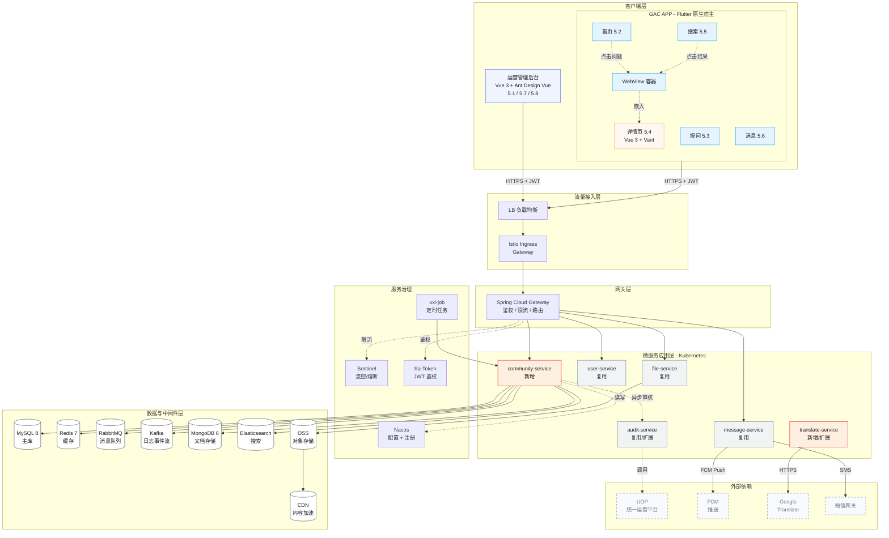
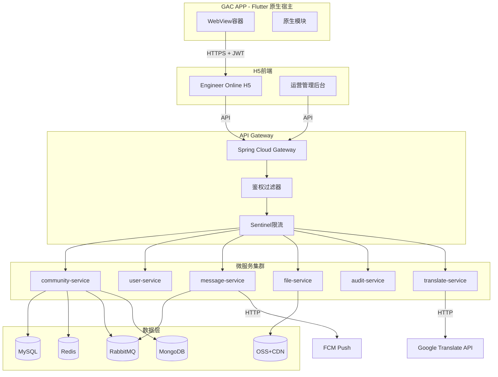
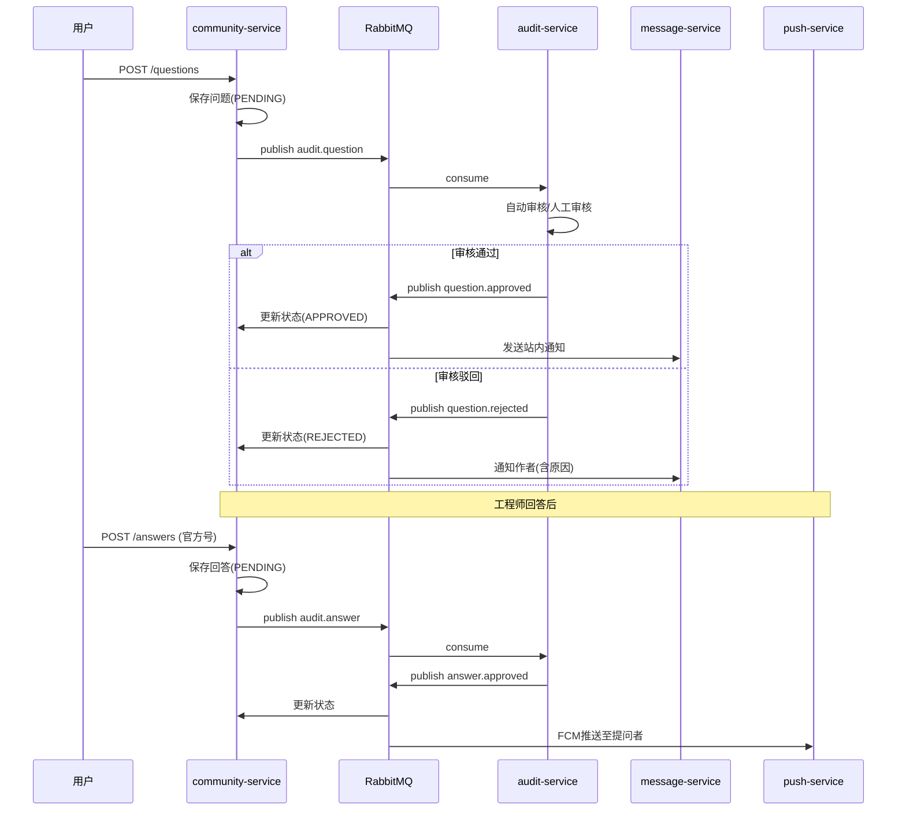

# Engineer Online — 技术架构与开发规范

> **文档版本**: 1.0.0  
> **更新日期**: 2026-04-26  
> **适用范围**: Engineer Online（在线工程师）项目全模块  
> **关联文档**: `requirement/00-需求总览.md`, `requirement/modules/05.01~05.09`

---

## 1. 技术栈总览

### 1.1 架构全景



> **图例**：
> - 🟦 蓝色 = Flutter 原生页面（5.2 / 5.3 / 5.5 / 5.6）
> - 🟧 橙色 = H5 WebView 子页面（仅 5.4）
> - 🟪 紫色 = Web 运营管理后台（5.1 / 5.7 / 5.8）
> - 🟥 红色 = 本项目新增微服务
> - ⬜ 灰色 = 复用已有微服务
> - 虚线 = 异步 / 外部调用

### 1.2 技术选型矩阵

| 层级                                    | 技术/框架                       | 版本        | 用途                  | 备注                                         |
| ------------------------------------- | --------------------------- | --------- | ------------------- | ------------------------------------------ |
| **移动端 Flutter**<br/>（5.2/5.3/5.5/5.6） | Flutter                     | 3.x       | 原生 UI 框架            | GAC APP 主体                                 |
|                                       | Dart                        | 3.x       | 语言                  | -                                          |
|                                       | Riverpod                    | 2.x       | 状态管理                | 推荐；亦可 Provider/BLoC                        |
|                                       | GoRouter                    | 14.x      | 路由                  | 与 App 主导航协同                                |
|                                       | Dio + Retrofit              | 5.x / 4.x | HTTP / typed client | Interceptor 注入 JWT                         |
|                                       | cached_network_image        | 3.x       | 图片缓存                | -                                          |
|                                       | webview_flutter             | 4.x       | H5 容器               | 仅承载 5.4 详情页                                |
|                                       | intl + ARB                  | -         | 国际化                 | 与 requirement/多语言文本.md 同源 |
|                                       | get_it                      | 7.x       | 依赖注入                | -                                          |
|                                       | freezed + json_serializable | -         | 不可变数据 + JSON 解析     | -                                          |
| **移动端 H5**<br/>（仅 5.4 详情）             | Vue                         | 3.4+      | 视图框架                | Composition API 为主                         |
|                                       | NuxtJS                      | 3.12+     | SSG/路由              | 单页面应用，构建 SSG                               |
|                                       | Vant                        | 4.x       | 移动 UI 组件            | 仅本页面使用                                     |
|                                       | Pinia                       | 2.x       | 状态管理                | -                                          |
|                                       | Vue I18n                    | 9.x       | 国际化                 | 中/英/泰三语                                    |
|                                       | TypeScript                  | 5.4+      | 类型系统                | 严格模式开启                                     |
|                                       | Less                        | 4.x       | CSS 预处理器            | -                                          |
|                                       | Pnpm                        | 8.x       | 包管理                 | monorepo/workspace 支持                      |
| **后台前端**                              | Vue                         | 3.4+      | 视图框架                | -                                          |
|                                       | Ant Design Vue              | 4.x       | PC 端 UI 组件          | 与现有运营管理后台风格统一                              |
|                                       | Pinia                       | 2.x       | 状态管理                | -                                          |
|                                       | TypeScript                  | 5.4+      | 类型系统                | -                                          |
| **服务端**                               | JDK                         | 17+       | 运行时                 | LTS版本                                      |
|                                       | Spring Boot                 | 3.2+      | 应用框架                | -                                          |
|                                       | Spring Cloud                | 2023.0.x  | 微服务框架               | -                                          |
|                                       | spring-cloud-alibaba        | 2023.x    | 阿里生态                | Nacos/Sentinel适配                           |
|                                       | MyBatis Plus                | 3.5+      | ORM                 | 复杂查询用XML，简单用注解                             |
|                                       | ShardingSphere              | 5.x       | 分库分表                | 预留扩展，初期单库                                  |
|                                       | MapStruct                   | 1.5+      | DTO/Entity转换        | 编译期生成，零反射                                  |
|                                       | Sa-Token                    | 1.37+     | 认证鉴权                | 适配JWT + 分布式Session                         |
|                                       | MySQL                       | 8.0+      | 主数据库                | InnoDB引擎，UTF8MB4                           |
|                                       | Redis                       | 7.x       | 缓存/会话               | 集群模式                                       |
|                                       | RabbitMQ                    | 3.12+     | 消息队列                | 审核、推送等异步流程                                 |
|                                       | Kafka                       | 3.x       | 日志/事件流              | 埋点、审计日志                                    |
|                                       | MongoDB                     | 6.x       | 文档存储                | 操作日志、非结构化数据                                |
|                                       | OSS                         | 阿里云/腾讯云   | 对象存储                | 图片/视频/文件                                   |
|                                       | CDN                         | 阿里云/腾讯云   | 内容加速                | 静态资源、图片分发                                  |
|                                       | Nacos                       | 2.x       | 配置中心+注册中心           | -                                          |
|                                       | Sentinel                    | 1.8+      | 流量控制                | 熔断、限流、降级                                   |
|                                       | xxl-job                     | 2.4+      | 定时任务                | 分布式调度                                      |
|                                       | Skywalking                  | 9.x       | APM链路追踪             | -                                          |
|                                       | Prometheus                  | 2.x       | 指标采集                | -                                          |
|                                       | Grafana                     | 10.x      | 监控可视化               | -                                          |
| **跨端集成**                              | JSBridge                    | 自定义协议     | Flutter ↔ H5 通信     | 仅 5.4 用，见第 8 章                             |
|                                       | Design Token                | 共享常量      | UI 一致性              | Flutter / H5 / 运营管理后台 同源                   |

---

## 2. 系统架构设计

### 2.1 微服务划分

Engineer Online 作为 GAC APP 内的社区模块，在现有微服务架构中新增或复用以下服务：

| 服务名 | 职责 | 类型 | 说明 |
|--------|------|------|------|
| `community-service` | 社区核心服务 | 新增 | 圈子、问题、回答、投票、搜索 |
| `user-service` | 用户中心 | 复用 | 用户信息、角色、权限 |
| `message-service` | 消息中心 | 复用 | 站内信、推送、通知模板 |
| `file-service` | 文件服务 | 复用 | 上传、OSS签名、CDN刷新 |
| `audit-service` | 内容审核 | 复用/扩展 | 敏感词、人工审核队列 |
| `translate-service` | 翻译服务 | 复用/扩展 | Google Translate API封装 |
| `gateway-service` | 网关 | 复用 | 统一入口、鉴权、限流、路由 |

### 2.2 服务调用关系



### 2.3 部署架构

```
┌────────────────────────────────────────┐
│              K8s Cluster               │
│  ┌────────────────────────────────┐   │
│  │     Istio Ingress Gateway      │   │
│  │   (TLS终止 / 路由 / 限流)       │   │
│  └────────────────────────────────┘   │
│              │                         │
│  ┌───────────┼───────────┐             │
│  ▼           ▼           ▼             │
│ ┌────┐   ┌────┐   ┌────────────┐     │
│ │H5  │   │运营 │  │ Gateway    │     │
│ │Pod │   │Pod │   │ Pod x3     │     │
│ └────┘   └────┘   └────────────┘     │
│                        │              │
│           ┌────────────┼────────────┐ │
│           ▼            ▼            ▼ │
│      ┌────────┐  ┌────────┐  ┌──────┐│
│      │community│  │ user   │  │ msg  ││
│      │ x3     │  │ x2     │  │ x2   ││
│      └────────┘  └────────┘  └──────┘│
└────────────────────────────────────────┘
```

---

## 3. 前端开发规范

> **移动端架构定调**：GAC APP 是 Flutter 原生宿主。本模块在 App 内的页面分两类承载方式：
>
> | 模块 | 承载方式 | 选型理由 |
> |------|----------|---------|
> | 5.2 首页 / 5.3 提问 / 5.5 搜索 / 5.6 消息 | **Flutter 原生** | 性能、列表手势、与 App 主导航无缝衔接 |
> | 5.4 问题详情 | **H5 WebView** | 翻译/嵌套回复迭代快，前端独立发版避免 App 跟随 |
> | 5.1 / 5.7 / 5.8 后台 | 运营管理后台 | 与 GAC 既有运营后台风格一致 |
>
> 三套技术栈的 Design Token 完全共享（颜色、字号、间距、圆角），由 `UI设计规范.md` 第 1 章定义。

### 3.1 Flutter 原生（5.2 / 5.3 / 5.5 / 5.6）

#### 技术约束
- **框架**: Flutter 3.x，Dart 3.x
- **状态**: Riverpod 2.x（推荐）或 Provider，按模块拆分
- **路由**: GoRouter；与 App 主导航协同
- **网络**: Dio + Retrofit 生成 typed client；Interceptor 统一注入 JWT、限流、429 退避
- **UI**: Material 3 + Cupertino + 自定义 widgets；颜色/字号严格走 Design Token
- **图片**: `cached_network_image` + 占位骨架；列表懒加载
- **国际化**: `intl` + ARB；key 与 `requirement/多语言文本.md` 一一对应（zh/en/th）
- **持久化**: `shared_preferences`（轻量）/ `drift`（结构化）
- **依赖注入**: `get_it` + Riverpod
- **测试**: `flutter_test` + `mockito` + 集成 `integration_test`

#### 目录结构

```
mobile/engineer_online/
├── lib/
│   ├── main.dart
│   ├── app.dart                      # 根 widget，路由表
│   ├── core/
│   │   ├── design_tokens.dart       # 从 UI设计规范 同步生成的颜色/字号/间距常量
│   │   ├── theme.dart               # MaterialTheme 定义
│   │   ├── i18n/                    # 国际化（生成自 requirement/多语言文本.md）
│   │   │   ├── app_zh.arb
│   │   │   ├── app_en.arb
│   │   │   └── app_th.arb
│   │   ├── network/
│   │   │   ├── api_client.dart      # Dio 配置
│   │   │   └── interceptors/        # auth / log / retry / 429
│   │   ├── permissions.dart         # PermissionCode 常量（生成自 00-需求总览 3.4）
│   │   └── utils/
│   │       ├── format.dart          # 时间 / 数字格式化
│   │       └── validators.dart
│   ├── features/
│   │   ├── home/                    # 5.2 圈子首页（Flutter）
│   │   │   ├── view/
│   │   │   │   └── home_page.dart
│   │   │   ├── widgets/
│   │   │   │   ├── question_card.dart
│   │   │   │   ├── stats_section.dart
│   │   │   │   └── tab_bar.dart
│   │   │   ├── controller/
│   │   │   │   └── home_controller.dart   # Riverpod
│   │   │   └── repository/
│   │   │       └── question_repository.dart
│   │   ├── ask/                      # 5.3 提问页（Flutter）
│   │   ├── search/                   # 5.5 搜索（Flutter）
│   │   ├── notifications/            # 5.6 消息（Flutter）
│   │   └── detail_webview/           # 5.4 详情页 WebView 容器
│   │       ├── view/
│   │       │   └── question_detail_webview_page.dart
│   │       └── bridge/
│   │           └── h5_bridge.dart    # 与 H5 双向通信
│   ├── data/
│   │   ├── models/                   # 业务实体（与 PRD 5.x.6 对应）
│   │   └── enums/                    # ReviewStatus / Role / VoteType
│   └── shared/
│       └── widgets/                   # 跨 feature 共享组件
├── test/
├── integration_test/
├── pubspec.yaml
└── analysis_options.yaml
```

> 注：`features/detail_webview/` 是 5.4 H5 详情页的原生壳容器，仅承担 URL 拼接、JWT 注入、回退手势处理；详情页 UI 在 H5 项目里实现（见 3.2）。

#### 关键编码规范

**1. 命名**
- File：snake_case（`question_card.dart`）
- Class / widget：PascalCase
- 常量：UPPER_SNAKE_CASE 或 lowerCamelCase（按 Dart 风格）

**2. Design Token 引用**

```dart
// core/design_tokens.dart（部分）
class AppColors {
  static const primary = Color(0xFF009EFF);
  static const textPrimary = Color(0xFF191A1D);
  // …
}

class AppSpacing {
  static const x4 = 16.0;
  // …
}
```

```dart
// 使用
Container(
  padding: const EdgeInsets.all(AppSpacing.x4),
  color: AppColors.primary,
  child: Text(t.home_brand_name, style: TextTheme.of(context).titleLarge),
)
```

**3. API 请求**

```dart
// data/repository/question_repository.dart
@RestApi()
abstract class QuestionApi {
  factory QuestionApi(Dio dio) = _QuestionApi;

  @GET('/api/v1/groups/{groupId}/questions')
  Future<CursorPage<QuestionListVO>> list(
    @Path() int groupId,
    @Query('tab') String tab,
    @Query('cursor') String? cursor,
    @Query('limit') int limit,
  );
}
```

**4. 列表页状态**

```dart
class ListState<T> {
  final List<T> items;
  final bool loading;
  final bool refreshing;
  final String? errorMessage;
  final String? nextCursor;
  bool get hasMore => nextCursor != null;
  bool get isEmpty => !loading && items.isEmpty;
}
```

**5. 与 H5 详情页通信（Flutter → H5 / H5 → Flutter）**

详见 8.1 JSBridge 协议。Flutter 侧通过 `webview_flutter` 的 `addJavaScriptChannel` 暴露原生能力。

### 3.2 H5 WebView（仅 5.4 问题详情）

#### 技术约束
- **框架**: Vue 3.4+，使用 `<script setup>` + Composition API
- **SSR**: NuxtJS 3.12+，采用 **SSG 模式**为主（详情页 SEO 收益不大，但加载更快）
- **UI 库**: Vant 4.x（仅本页使用）
- **样式**: Less + CSS 变量（Design Token，与 Flutter 端常量同源）
- **状态**: Pinia 2.x
- **HTTP**: 封装基于 `ofetch`（Nuxt 内置）
- **构建**: Pnpm workspace
- **承载**: 通过 `webview_flutter` 在 GAC APP 内打开

#### 目录结构

```
apps/h5-detail/                     # 仅承载 5.4 详情页
├── .nuxt/                          # Nuxt 生成（gitignore）
├── .output/                        # 构建输出（gitignore）
├── assets/styles/
│   ├── variables.less              # 全局 Less 变量
│   ├── design-tokens.css           # 与 Flutter 同源的 CSS 变量
│   └── index.less
├── components/
│   ├── AnswerCard.vue
│   ├── QuestionHeader.vue
│   ├── ReplyComposer.vue
│   └── TranslateButton.vue
├── composables/
│   ├── useTranslate.ts
│   ├── useVote.ts
│   └── useBackHandler.ts            # 监听原生返回
├── pages/
│   └── question/
│       └── [id].vue                # 唯一页面：问题详情
├── plugins/
│   ├── vant.ts
│   ├── i18n.ts
│   └── bridge.ts
├── stores/
│   └── question.ts
├── types/
│   ├── api.d.ts
│   ├── entity.d.ts
│   └── bridge.d.ts
├── utils/
│   ├── request.ts
│   ├── bridge.ts
│   ├── format.ts
│   └── validators.ts
├── nuxt.config.ts
└── package.json
```

> H5 仅承载详情页，因此目录显著简化。无路由列表、无 ask 页面、无 search 页面。

#### 关键编码规范

**1. 组件命名**
- 文件：PascalCase（`AnswerCard.vue`）
- 模板：kebab-case（`<answer-card />`）

**2. 类型定义**

```typescript
// types/entity.d.ts
interface Question {
  id: number;
  title: string;
  content?: string;
  images: string[];
  vehicleModel?: string;
  totalMileage?: string;
  reviewStatus: 'PENDING' | 'APPROVED' | 'REJECTED';
  isHot: boolean;
  isHidden: boolean;
  answerCount: number;
  viewCount: number;
  createdAt: string; // ISO 8601
  author: UserBrief;
}

interface UserBrief {
  id: number;
  nickname: string;
  avatar: string;
  role: 'REGULAR' | 'CAR_OWNER' | 'AUTH_OWNER' | 'OFFICIAL_ENGINEER' | 'OFFICIAL_PM' | 'ADMIN';
  officialInfo?: {
    brandLabel: string;  // e.g., "GAC"
    position: string;    // e.g., "Product Manager"
    verified: boolean;
  };
}
```

**3. API 请求封装**

```typescript
// utils/request.ts
import { ofetch } from 'ofetch';

export const api = ofetch.create({
  baseURL: process.env.NUXT_PUBLIC_API_BASE || '',
  headers: { 'Content-Type': 'application/json' },
  onRequest({ options }) {
    const token = useBridge().getToken();         // 从 Flutter 取
    if (token) options.headers = { ...options.headers, Authorization: `Bearer ${token}` };
  },
  onResponseError({ response }) {
    if (response.status === 401) useBridge().navigateToLogin();
  },
});
```

**4. 与 Flutter 通信**

详见 8.1 JSBridge 协议。本页面所有调用原生能力（图片预览、分享、回退手势、获取主题色）都走 Bridge。

### 3.3 管理后台（运营管理后台，5.1 / 5.7 / 5.8）

#### 技术约束
- **框架**: Vue 3.4+ + Vite（无需SSR）
- **UI库**: Ant Design Vue 4.x
- **路由**: Vue Router 4.x
- **状态**: Pinia 2.x
- **HTTP**: Axios

#### 目录结构

```
apps/operation-admin/
├── public/
├── src/
│   ├── api/                     # API接口（按模块）
│   │   ├── question.ts
│   │   ├── answer.ts
│   │   ├── group.ts
│   │   └── audit.ts
│   ├── assets/
│   ├── components/              # 公共组件
│   │   ├── AppLayout.vue
│   │   ├── DataTable.vue        # 封装表格（含筛选、分页、批量）
│   │   └── AuditModal.vue       # 审核弹窗
│   ├── composables/
│   ├── router/
│   │   └── index.ts             # 路由配置
│   ├── stores/
│   ├── types/
│   ├── utils/
│   │   ├── request.ts           # Axios封装
│   │   └── permissions.ts       # 权限校验工具
│   └── views/                   # 页面
│       ├── LoginView.vue
│       ├── DashboardView.vue
│       ├── group/
│       │   ├── GroupList.vue
│       │   └── GroupForm.vue
│       ├── question/
│       │   ├── QuestionList.vue
│       │   ├── QuestionDetailDrawer.vue
│       │   └── QuestionForm.vue
│       └── answer/
│           ├── AnswerList.vue
│           └── AnswerDetailDrawer.vue
├── index.html
├── vite.config.ts
├── tsconfig.json
└── package.json
```

#### 关键编码规范

**1. 表格组件封装**
所有后台列表页使用统一封装的 `DataTable` 组件，支持：
- 内置筛选区（根据配置自动生成）
- 分页（传统分页，默认20条/页）
- 批量操作（勾选 + 批量按钮）
- 列自定义（显示/隐藏）
- 排序

**2. 表单抽屉**
新建/编辑统一使用右侧抽屉（Drawer），宽度：600px。

**3. 权限指令**
```typescript
// 指令: v-permission="['admin']"
// 无权限时元素不渲染（而非禁用）
```

---

## 4. 后端开发规范

### 4.1 工程结构

```
community-service/
├── src/main/java/com/aion/community/
│   ├── CommunityApplication.java
│   ├── config/                    # 配置类
│   │   ├── MybatisPlusConfig.java
│   │   ├── RedisConfig.java
│   │   ├── RabbitMQConfig.java
│   │   └── SaTokenConfig.java
│   ├── controller/                # 控制器层
│   │   ├── GroupController.java
│   │   ├── QuestionController.java
│   │   ├── AnswerController.java
│   │   ├── VoteController.java
│   │   ├── NotificationController.java
│   │   └── SearchController.java
│   ├── service/                   # 服务层
│   │   ├── GroupService.java
│   │   ├── QuestionService.java
│   │   ├── AnswerService.java
│   │   ├── VoteService.java
│   │   ├── NotificationService.java
│   │   └── SearchService.java
│   ├── mapper/                    # MyBatis Plus Mapper
│   ├── entity/                    # 数据库实体（DO）
│   ├── dto/                       # 数据传输对象
│   │   ├── request/               # 入参DTO
│   │   └── response/              # 出参DTO
│   ├── vo/                        # 视图对象（返回给前端的扁平结构）
│   ├── enums/                     # 枚举
│   ├── event/                     # 领域事件
│   ├── listener/                  # 事件监听
│   ├── task/                      # 定时任务（xxl-job）
│   ├── infrastructure/            # 基础设施
│   │   ├── repository/            # 仓储实现
│   │   ├── client/                # Feign客户端
│   │   └── cache/                 # 缓存封装
│   └── utils/                     # 工具类
├── src/main/resources/
│   ├── application.yml
│   ├── application-dev.yml
│   ├── application-prod.yml
│   └── mapper/                    # XML映射文件
├── pom.xml
└── Dockerfile
```

### 4.2 分层规范

| 层级 | 职责 | 禁止事项 |
|------|------|---------|
| **Controller** | 接收HTTP请求，参数校验，调用Service，返回VO | 禁止写业务逻辑、禁止直接调用Mapper |
| **Service** | 业务逻辑编排，事务管理，事件发布 | 禁止直接返回Entity、禁止跨服务直接访问数据库 |
| **Mapper/DAO** | 数据访问，SQL映射 | 禁止写复杂业务逻辑在SQL中（用Service层处理） |
| **Entity** | 数据库表映射（DO） | 禁止作为API返回对象 |
| **DTO** | 层间数据传输 | 禁止跨层混用（RequestDTO不进入Service） |
| **VO** | 前端视图对象 | 禁止包含敏感字段（如userId脱敏） |

### 4.3 编码规范

**1. 接口定义**
```java
@RestController
@RequestMapping("/api/v1/groups/{groupId}/questions")
@Validated
public class QuestionController {

    @GetMapping
    public Result<PageVO<QuestionVO>> list(
            @PathVariable @Positive Long groupId,
            @RequestParam(defaultValue = "hot") QuestionTab tab,
            @RequestParam(defaultValue = "1") @Min(1) int page,
            @RequestParam(defaultValue = "20") @Range(1, 50) int pageSize) {
        return Result.ok(questionService.list(groupId, tab, page, pageSize));
    }

    @PostMapping
    @SaCheckRole("CAR_OWNER")
    public Result<Long> create(
            @PathVariable Long groupId,
            @RequestBody @Valid QuestionCreateDTO dto) {
        return Result.ok(questionService.create(groupId, dto));
    }
}
```

**2. 统一返回结构**
```json
{
  "code": 0,
  "message": "success",
  "data": {},
  "traceId": "abc123",
  "timestamp": 1714123456789
}
```

**3. 异常处理**
使用 `@RestControllerAdvice` 统一捕获：
- `MethodArgumentNotValidException` → 参数校验错误（code: 1001）
- `BusinessException` → 业务异常（code: 4xxx/5xxx）
- `Exception` → 系统异常（code: 9999，不暴露详情）

### 4.4 数据库规范

**命名规范**:
- 表名：`t_{模块}_{实体}`，如 `t_community_question`, `t_community_answer`
- 字段：snake_case，如 `created_at`, `is_hot`
- 索引：`idx_{表}_{字段}`，唯一索引：`uk_{表}_{字段}`

**字段规范**:

| 类型 | 场景 | 示例 |
|------|------|------|
| BIGINT | 主键、外键、用户ID | `id`, `author_id` |
| VARCHAR(200) | 标题、名称 | `title` |
| TEXT | 长文本 | `content` |
| JSON | 数组、灵活结构 | `images`, `notification_channels` |
| TINYINT | 状态、布尔 | `review_status`, `is_hot` |
| DECIMAL(10,2) | 金额、精确数值 | - |
| TIMESTAMPTZ | 时间戳 | `created_at` |

**必须字段**（每张表）:
- `id` BIGINT PK AUTO_INCREMENT
- `created_at` TIMESTAMPTZ DEFAULT now()
- `updated_at` TIMESTAMPTZ DEFAULT now() ON UPDATE now()
- `deleted` TINYINT DEFAULT 0（逻辑删除标记，MyBatis Plus自动处理）

**索引策略**:
- 外键必须建索引
- 列表查询的筛选字段建复合索引（遵循最左前缀）
- 时间范围查询字段单独索引或放在复合索引最后

---

## 5. 接口规范

### 5.1 RESTful API 设计

**基础路径**: `/api/v1`

**资源命名**:
```
GET    /api/v1/groups                          # 圈子列表
GET    /api/v1/groups/{id}                     # 圈子详情
GET    /api/v1/groups/{id}/questions           # 问题列表
POST   /api/v1/groups/{id}/questions           # 发布问题
GET    /api/v1/questions/{id}                   # 问题详情
DELETE /api/v1/questions/{id}                   # 删除问题
POST   /api/v1/questions/{id}/answers           # 回答问题
POST   /api/v1/answers/{id}/accept              # 采纳回答
POST   /api/v1/answers/{id}/vote                # 投票
GET    /api/v1/notifications                    # 通知列表
PUT    /api/v1/notifications/{id}/read          # 标记已读
```

**HTTP状态码语义**:

| 状态码 | 使用场景 |
|--------|---------|
| 200 | GET/PUT/DELETE成功 |
| 201 | POST创建成功 |
| 204 | 无返回内容（如删除成功） |
| 400 | 请求参数错误 |
| 401 | 未登录或Token无效 |
| 403 | 无权限（角色/圈子配置限制） |
| 404 | 资源不存在 |
| 409 | 业务冲突（如重复操作） |
| 429 | 请求过于频繁（Sentinel限流） |
| 500 | 服务器内部错误 |

### 5.2 分页规范

**请求**:
```
GET /groups/1/questions?page=1&page_size=20&tab=hot
```

**响应**:
```json
{
  "code": 0,
  "data": {
    "list": [],
    "pagination": {
      "page": 1,
      "page_size": 20,
      "total": 1203,
      "total_pages": 61,
      "has_more": true
    }
  }
}
```

**移动端无限滚动**: 使用 `cursor`（游标）分页替代页码，避免数据漂移：
```
GET /questions?cursor=eyJpZCI6MTAwLCJ0aW1lIjoxNzE0MTIzNDU2fQ==&limit=20
```

### 5.3 错误码体系

采用 **分层 + 模块** 编码策略：

| 错误码段 | 范围 | 类别 | 说明 |
|---|---|---|---|
| 0 | 0 | 成功 | success |
| 1xxx | 1000-1999 | 通用/参数 | 参数校验、限流、签名等 |
| 2xxx | 2000-2999 | 认证/权限/用户 | 登录、Token、角色、用户 |
| 3xxx | 3000-3999 | 圈子模块 | Group 相关 |
| 4xxx | 4000-4999 | 问题模块 | Question 相关 |
| 5xxx | 5000-5999 | 回答模块 | Answer 相关 |
| 6xxx | 6000-6999 | 审核/内容 | 审核、敏感词、UOP |
| 7xxx | 7000-7999 | 消息/推送 | Notification、FCM |
| 8xxx | 8000-8999 | 文件/翻译 | File、Translate、OSS |
| 9xxx | 9000-9999 | 系统/外部 | 数据库、缓存、第三方服务 |

> **详细错误码表（SSOT）**：见 `design/错误码.md`。本文档不再重复罗列，以避免双源不一致。

**错误响应示例**:
```json
{
  "code": 4002,
  "message": "标题至少5个字符",
  "data": {
    "field": "title",
    "current": 2,
    "min": 5
  },
  "traceId": "trace-abc-123",
  "timestamp": 1714123456789
}
```

### 5.4 Cursor 分页响应格式（移动端）

所有移动端列表接口统一使用 cursor 分页（GR-PAGE-01）。

**请求参数**：

| 参数 | 类型 | 必填 | 说明 |
|---|---|---|---|
| `cursor` | String | 否 | 上一页最后一条记录的游标值；首次请求不传 |
| `limit` | Integer | 否 | 每页条数，默认 20，最大 50 |

**响应格式**：

```json
{
  "code": 0,
  "data": {
    "items": [...],
    "nextCursor": "eyJpZCI6MTAwfQ==",
    "hasMore": true,
    "total": 1234
  }
}
```

| 字段 | 类型 | 说明 |
|---|---|---|
| `items` | Array | 当前页数据列表 |
| `nextCursor` | String / null | 下一页游标；null 表示没有更多数据 |
| `hasMore` | Boolean | 是否还有下一页 |
| `total` | Integer | 总记录数（可选，仅首次请求返回，后续可省略以提升性能） |

**游标编码**：Base64 编码的 JSON，包含排序字段值（如 `{"id": 100, "created_at": "2026-05-12T10:00:00"}`）。

**后台管理端**继续使用传统 page/pageSize 分页（GR-PAGE-02）。

---

## 6. 数据存储规范

### 6.1 MySQL 主库设计

**核心表清单**:

| 表名 | 说明 | 数据量预估 |
|------|------|-----------|
| `t_community_group` | 圈子主表 | < 100条 |
| `t_community_group_translation` | 圈子多语言 | < 300条 |
| `t_community_question` | 问题主表 | 100万+ |
| `t_community_answer` | 回答/回复表 | 500万+ |
| `t_community_vote` | 投票记录 | 1000万+ |
| `t_community_notification` | 通知记录 | 1000万+ |
| `t_community_audit_log` | 审核日志 | 500万+ |

**分表策略**（初期单表，预留扩展）:
- `t_community_question`: 按 `group_id` + 时间分表（ShardingSphere）
- `t_community_answer`: 按 `question_id` 取模分表
- `t_community_notification`: 按 `user_id` 取模分表

### 6.2 Redis 缓存策略

| Key模式 | 类型 | TTL | 说明 |
|---------|------|-----|------|
| `group:config:{id}` | String | 1h | 圈子配置缓存 |
| `group:permissions:{user_id}:{group_id}` | String | 30m | 用户圈子权限缓存 |
| `question:detail:{id}` | Hash | 30m | 问题详情缓存 |
| `question:list:{group_id}:{tab}:{page}` | List | 10m | 问题列表缓存 |
| `answer:list:{question_id}` | List | 10m | 回答列表缓存 |
| `user:profile:{id}` | String | 1h | 用户信息缓存（来自user-service） |
| `translate:{hash}:{target_lang}` | String | 7d | 翻译结果缓存 |
| `rate_limit:{user_id}:{api}` | String | 1m | 接口限流计数 |

**缓存更新策略**: Cache-Aside（先更新DB，再删除缓存），配合Canal或MQ异步同步。

**缓存失效触发条件**：

| 缓存 Key | 失效触发操作 |
|---------|------------|
| `group:config:{id}` | 圈子配置编辑、启用/禁用、删除 |
| `group:permissions:{user_id}:{group_id}` | 用户角色变更、圈子配置变更 |
| `question:detail:{id}` | 问题内容变更、审核状态变更、公开状态变更、删除、采纳状态变更 |
| `question:list:{group_id}:{tab}:{page}` | 问题新增、删除、审核通过、热门状态变更、排序序号变更 |
| `answer:list:{question_id}` | 回答新增、删除、审核通过、采纳状态变更 |
| `user:profile:{id}` | 用户信息变更 |
| `translate:{hash}:{target_lang}` | 7天过期自动失效，不主动删除 |

### 6.3 MongoDB 使用场景

- **操作日志**: `operation_logs` collection，结构化存储管理员操作
- **搜索索引**: 问题/回答的全文搜索索引（ES 降级方案本期暂不实现）
- **埋点数据**: 用户行为事件（后续分析用）

### 6.4 OSS 与 CDN

**文件路径规范**:
```
community/{env}/{date}/{uuid}.{ext}
# 例: community/prod/20260426/a1b2c3d4.jpg
```

**上传流程**:
1. H5请求 `file-service` 获取STS临时凭证（或预签名URL）
2. H5直传OSS（减少服务端带宽）
3. 上传成功后回调 `file-service` 记录元数据
4. 返回CDN访问URL给前端

**媒体处理**:
- 所有媒体（图片+视频）统一提供 `coverUrl` 作为缩略图
- **原文件压缩**（客户端完成）：
  - 图片：长边 ≤ 1200px，质量 80%
  - 视频：压缩至 ≤ 50MB（分辨率 720p，码率 2Mbps）
- **缩略图生成**（客户端完成）：
  - 图片缩略图：原图压缩后居中裁剪为 450×450px，质量 75%，与原图分开上传
  - 视频封面：从压缩后的视频截取第一帧，裁剪为 450×450px，质量 75%，与视频分开上传
- **文件路径**：原文件 `community/{env}/{date}/{uuid}.{ext}`，缩略图 `community/{env}/{date}/{uuid}-thumb.{ext}`
- **视频时长**：客户端从原视频读取 duration（秒），随 MediaItem 一并提交
- 详情页点开放大/播放时访问 `url`，列表/卡片缩略图统一使用 `coverUrl`

---

## 7. 消息与事件规范

### 7.1 RabbitMQ 队列设计

| Exchange | Queue | Routing Key | 说明 |
|----------|-------|-------------|------|
| `community.exchange` | `community.audit.question` | `audit.question` | 问题审核事件 |
| `community.exchange` | `community.audit.answer` | `audit.answer` | 回答审核事件 |
| `community.exchange` | `community.push.notification` | `push.notification` | 推送通知事件 |
| `community.exchange` | `community.search.index` | `search.index` | 搜索索引更新 |

**消息格式**:
```json
{
  "eventId": "evt-uuid",
  "eventType": "QUESTION_APPROVED",
  "timestamp": 1714123456789,
  "payload": {
    "questionId": 12345,
    "groupId": 1,
    "authorId": 67890
  }
}
```

### 7.2 核心事件流



---

## 8. Flutter WebView 集成规范（仅适用于 5.4 详情页）

> 本章约束 **仅适用于 5.4 问题详情**（H5 WebView 承载页面）。Flutter 原生页面（5.2/5.3/5.5/5.6）直接调用后端 API，不走 JSBridge。

### 8.1 JSBridge 协议

H5与Flutter通过 `jssdk` 通信，协议格式：

```typescript
// 调用原生能力
window.flutterBridge.callNative(method: string, params: object): Promise<any>

// 监听原生事件
window.flutterBridge.onNativeEvent(event: string, callback: Function)
```

**标准API清单**:

| Method | 参数 | 返回值 | 说明 |
|--------|------|--------|------|
| `getToken` | - | `{ token: string }` | 获取JWT |
| `getUserInfo` | - | `{ userId, nickname, avatar, roles[] }` | 获取用户信息 |
| `getVehicleInfo` | - | `{ model, vin, mileage }` | 获取车辆信息 |
| `navigateToLogin` | - | - | 跳转登录页 |
| `share` | `{ title, desc, url, image }` | - | 分享 |
| `openImagePreview` | `{ urls[], currentIndex }` | - | 图片预览 |
| `showToast` | `{ message, duration }` | - | 原生Toast |
| `setTitle` | `{ title }` | - | 设置导航栏标题 |
| `goBack` | - | - | 返回上一页 |

**封装示例**:
```typescript
// utils/bridge.ts
export class FlutterBridge {
  static async getToken(): Promise<string> {
    if (!window.flutterBridge) return '';
    const res = await window.flutterBridge.callNative('getToken', {});
    return res.token;
  }

  static async getVehicleInfo(): Promise<VehicleInfo | null> {
    if (!window.flutterBridge) return null;
    try {
      return await window.flutterBridge.callNative('getVehicleInfo', {});
    } catch {
      return null; // 未绑定车辆
    }
  }
}
```

### 8.2 登录态传递

1. **首次加载**: WebView URL携带 `?token={jwt}`，H5提取后存入内存（Pinia）
2. **Token刷新**: Flutter通过 `postMessage` 主动推送新Token，H5监听更新
3. **Token失效**: API返回401时，H5调用 `navigateToLogin()` 让Flutter处理

### 8.3 页面适配

- **安全区**: H5需适配刘海屏，使用 `env(safe-area-inset-top/bottom)`
- **返回手势**: 监听Flutter的返回事件，处理H5内部路由（如提问页返回需确认）
- **主题色**: 跟随App主题，通过JSBridge获取 `getThemeColor()`

---

## 9. 多语言实现规范

### 9.1 UI文本国际化

**方案**: Vue I18n + ICU MessageFormat

**目录结构**:
```
locales/
├── zh-CN.json       # 中文
├── en-US.json       # 英文
└── th-TH.json       # 泰文
```

**Key命名规范**:
```
{模块}.{页面}.{元素}
# 例:
question.home.tab_hot = "Hot"
question.detail.btn_accept = "Accept"
question.ask.placeholder_title = "Enter a title"
common.btn_confirm = "Confirm"
common.empty.no_questions = "No questions yet"
```

**使用示例**:
```vue
<template>
  <van-button>{{ $t('question.detail.btn_accept') }}</van-button>
  <p>{{ $t('notification.reply_content', { engineer: 'Wayne' }) }}</p>
</template>
```

### 9.2 UGC内容翻译

**触发时机**: 用户点击 "Translate" 按钮时调用（非自动翻译）

**API设计**:
```
POST /api/v1/translate
Request:
{
  "content": "原始内容",
  "targetLang": "en",        // 目标语言: zh/en/th
  "format": "text",          // `text` 或 `html`，透传给 Google Translate API
  "sourceId": 12345          // 可选，内容ID，用于业务缓存
}

Response:
{
  "code": 0,
  "data": {
    "translatedText": "翻译后内容"
  }
}
```

**缓存策略**:
- Redis Key: `translate:{source_id}:{target_lang}`（sourceId 存在时）
  或 `translate:{text_md5}:{target_lang}`（sourceId 为空时）
- TTL: 7天
- 内容变更时：sourceId 不变则按内容 ID 清除缓存

---

## 10. 安全规范

> 📌 **完整安全基线**已独立为 [`standard/安全基线.md`](安全基线.md)，包含认证授权、数据安全、注入防护、文件上传、接口安全、日志审计、依赖安全、密钥管理、事件响应等完整规范。以下为核心要点摘要。

### 10.1 认证鉴权

- **JWT**: 由 GAC APP 统一签发，HS256 签名，有效期 2 小时，Refresh Token 7 天
- **网关鉴权**: Gateway层解析JWT，注入 `X-User-Id`, `X-User-Roles` Header到下游服务
- **服务间调用**: 内部Feign调用携带 `X-Internal-Key` 防止外部伪造

### 10.2 数据安全

- **敏感字段脱敏**: 手机号 `138****1234`，邮箱 `a***@gmail.com`
- **XSS防护**: 所有用户输入内容入库前HTML转义，前端渲染使用 `v-text` 而非 `v-html`
- **SQL注入**: MyBatis Plus参数化查询，禁止字符串拼接SQL
- **文件安全**: OSS上传限制类型（jpg/png/gif/webp/mp4），单文件大小限制（图片≤5MB，视频≤50MB）

### 10.3 接口安全

- **限流**: Sentinel配置，单用户单接口 60次/分钟
- **防重放**: 请求头携带 `X-Timestamp` 和 `X-Nonce`，5分钟内重复Nonce拒绝
- **CORS**: H5域名白名单，运营管理后台 IP白名单

---

## 11. 性能与监控

### 11.1 性能目标

| 指标 | 目标值 | 测量方式 |
|------|--------|---------|
| H5首屏加载 | ≤ 1.5s | Lighthouse FCP |
| API P95响应 | ≤ 200ms | Prometheus |
| 搜索响应 | ≤ 500ms | 生产监控 |
| 图片加载 | ≤ 300ms | CDN监控 |
| 推送延迟 | ≤ 2s | 端到端追踪 |

### 11.2 监控体系

| 层级 | 工具 | 监控内容 |
|------|------|---------|
| 基础设施 | Prometheus + Grafana | CPU/内存/磁盘/网络 |
| 应用性能 | Skywalking | 链路追踪、慢SQL、慢接口 |
| 业务指标 | 自定义Metrics | QPS、错误率、缓存命中率 |
| 日志 | ELK / Loki | 应用日志、审计日志、错误日志 |
| 告警 | Prometheus Alertmanager | 接口P99>500ms、错误率>1%、磁盘>80% |

### 11.3 外部依赖 SLA（建议值，待 UOP 团队确认）

| 依赖服务 | 接口 | 超时 | 重试 | 降级策略 |
|----------|------|------|------|----------|
| UOP | 敏感词校验 | 3s | 1 次（间隔 500ms） | 校验失败时拒绝提交，返回 `CONTENT_SENSITIVE` |
| UOP | 问题推送 | 5s | 2 次（间隔 1s） | 标记 `SYNC_FAILED`，告警运营，允许管理员手动重试 |
| UOP | 回答推送 | 5s | 2 次（间隔 1s） | 标记 `SYNC_FAILED`，告警运营，允许管理员手动重试 |
| Google Translate | 文本翻译 | 3s | 1 次 | 保持原文，提示"翻译失败，请稍后重试" |
| FCM | Push 通知 | 3s | 1 次 | 记录失败日志，不阻断主流程 |
| OSS | 文件上传 | 30s | 2 次 | 返回上传失败，前端可重新上传 |

> **OQ-10 备注**：上表为开发阶段建议值，联调前需与 UOP 团队最终确认并更新。

### 11.4 缓存策略

**多级缓存**:
1. **L1 (Caffeine)**: 应用本地缓存，热点数据（圈子配置、用户权限），TTL 5分钟
2. **L2 (Redis)**: 分布式缓存，TTL 10分钟~1小时
3. **L3 (CDN)**: 静态资源、图片，TTL 1天

---

## 12. 开发环境规范

### 12.1 环境定义

| 环境 | 用途 | 数据库 | 数据 |
|------|------|--------|------|
| Local | 本地开发 | Docker Compose (MySQL+Redis+MQ) |  mock数据 |
| Dev | 联调测试 | 共享Dev库 | 可随意操作 |
| Test | 测试环境 | 独立Test库 | 自动化测试数据 |
| Staging | 预发布 | 生产镜像 | 脱敏生产数据 |
| Prod | 生产 | 主库+从库 | 真实数据 |

### 12.2 Docker Compose（本地开发）

```yaml
# docker-compose.yml
version: '3.8'
services:
  mysql:
    image: mysql:8.0
    ports: ["3306:3306"]
    environment:
      MYSQL_ROOT_PASSWORD: root
      MYSQL_DATABASE: community
  redis:
    image: redis:7-alpine
    ports: ["6379:6379"]
  rabbitmq:
    image: rabbitmq:3-management
    ports: ["5672:5672", "15672:15672"]
```

### 12.3 Git 工作流

采用 **Git Flow** 简化版:
```
main        → 生产分支，仅接受hotfix和release合并
develop     → 开发主分支，功能分支合并目标
feature/*   → 功能分支，从develop切出
release/*   → 发布分支，从develop切出，测试通过后合并到main
hotfix/*    → 线上修复分支，从main切出，合并到main和develop
```

**提交规范** (Conventional Commits):
```
feat: 新增问题发布功能
fix: 修复回答列表分页错误
docs: 更新API文档
style: 调整问题卡片样式
refactor: 重构审核状态机
test: 补充问题发布单元测试
chore: 更新依赖版本
```

---

## 13. Spec Coding 指令参考

> 推荐使用 `.kiro/skills/`（Kiro）或 `.claude/skills/`（Claude Code）中的角色 Skill，下面给出几个常见调用示例。

### 13.1 生成 Flutter 原生页面（5.2/5.3/5.5/5.6）

```
#flutter-dev 为 PRD 05.02（圈子首页）生成 Flutter 原生页面：
- 路径: lib/features/home/view/home_page.dart
- 包含: 品牌区、统计区、Tab(Hot/Newest/My Question)、问题卡片列表、Ask 按钮
- 使用 Riverpod 管理列表状态
- 调用 API: GET /api/v1/groups/{groupId}/questions?tab={tab}&cursor={cursor}&limit=20
- 列表用 ListView.builder + RefreshIndicator + 无限滚动
- 严格使用 core/design_tokens.dart 中的颜色/间距/字号常量
- 所有文本走 intl ARB（与 requirement/多语言文本.md 一致）
```

### 13.2 生成 H5 详情页组件（仅 5.4）

```
#h5-dev 为 PRD 05.04 生成 Vue 3 + NuxtJS + Vant 详情页：
- 路径: apps/h5-detail/pages/question/[id].vue
- 包含: 问题区、操作栏（翻译/删除）、回答列表、嵌套回复、图片预览
- 使用 Pinia 管理详情状态
- 调用 API: GET /api/v1/questions/{id} + GET /api/v1/questions/{id}/answers
- 翻译走 POST /api/v1/translate（缓存 7 天）
- 适配 Flutter WebView 安全区与返回手势（见第 8 章）
```

### 13.3 生成后端 Service

```
#backend-dev 为 PRD 05.03（问题发布）生成 Spring Boot 代码：
- Controller: QuestionController.create()
- Service: QuestionService.createQuestion()
- 校验: 标题 5-200 字符，图片 ≤9 张，用户有发表权限
- 发布后置: 保存问题(PENDING)，发送审核 MQ 消息
- 返回: 问题 ID
```

### 13.4 生成数据库 Schema

```
#db-design 为 PRD 05.02.6（Question 数据对象）生成 MySQL 建表语句：
- 表名: t_community_question
- 包含: 所有字段、索引、注释
- 字符集: utf8mb4
- 引擎: InnoDB
```

---

## 附录 A：术语对照表

| PRD术语 | 英文/代码命名 | 技术实现 |
|---------|--------------|---------|
| 圈子 | Group | `t_community_group` |
| 问题 | Question | `t_community_question` |
| 回答 | Answer | `t_community_answer` |
| 回复 | Reply | `t_community_answer` (parent_id非空) |
| 投票 | Vote | `t_community_vote` |
| 通知 | Notification | `t_community_notification` |
| 审核日志 | AuditLog | MongoDB `operation_logs` |
| 官方号 | OfficialAccount | `author_type = OFFICIAL_*` |
| 采纳 | Accept | `is_accepted = true` |
| 热门 | Hot | `is_hot = true` |

---

## 附录 B：外部服务集成清单

| 服务 | 集成方式 | 用途 | 环境变量Key |
|------|----------|------|------------|
| FCM | HTTP API (Server Key) | 推送通知 | `FCM_SERVER_KEY` |
| Google Translate | Cloud Translation API | 内容翻译 | `GOOGLE_TRANSLATE_API_KEY` |
| OSS | Aliyun OSS SDK | 文件存储 | `OSS_ACCESS_KEY_ID`, `OSS_SECRET` |
| CDN | URL拼接 | 静态加速 | `CDN_BASE_URL` |
| AION User Service | Feign Client | 用户信息 | `SERVICE_USER_URL` |
| AION Message Service | Feign Client / MQ | 站内信 | `SERVICE_MSG_URL` |
| AION File Service | Feign Client | 文件上传凭证 | `SERVICE_FILE_URL` |
